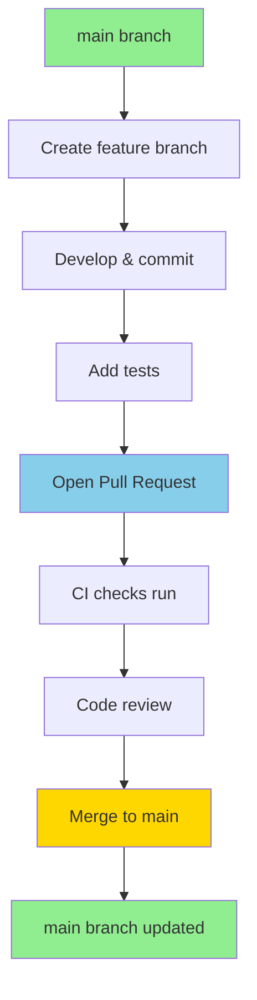

# Git Workflow

This diagram shows our standard branching strategy.

## Branching Strategy

- **main**: Primary branch, always deployable
- **feature/\***: New features and enhancements
- **fix/\***: Bug fixes
- **docs/\***: Documentation updates
- **chore/\***: Maintenance and tooling

## Workflow

1. Create branch from `main`
2. Make changes and commit
3. Open Pull Request
4. CI checks pass
5. Code review
6. Merge to `main`
