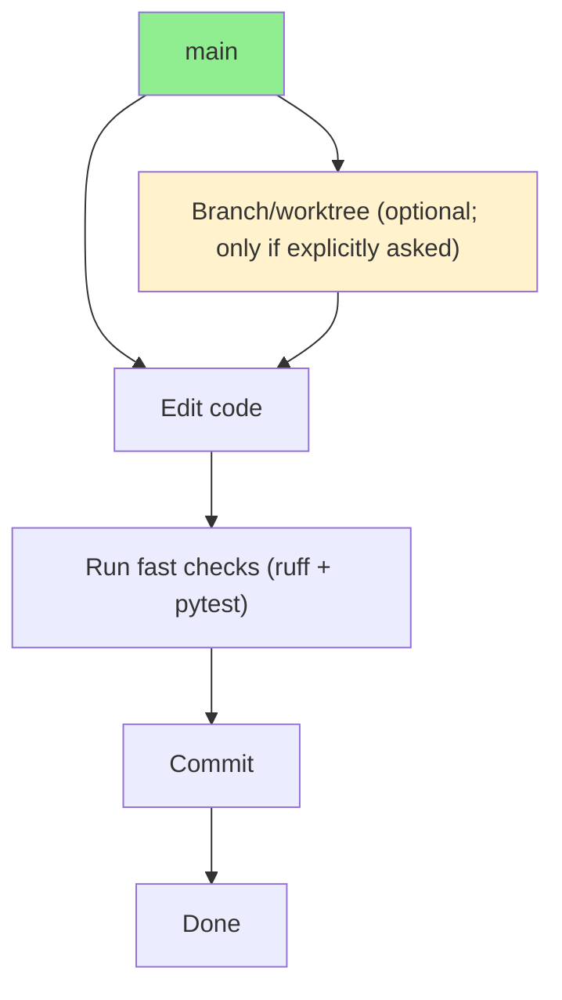

# Git Workflow

This repo does not prescribe a branching/worktree strategy.

- Default is work on `main`.
- Only create/use a branch or worktree if explicitly asked.

```mermaid
flowchart TB
    main["main"] --> edit["Edit code"]
    edit --> validate["Run fast checks (ruff + pytest)"]
    validate --> commit["Commit"]
    commit --> done["Done"]

    main --> optional["Branch/worktree (optional; only if explicitly asked)"]
    optional --> edit

    style main fill:#90EE90
    style optional fill:#FFF2CC
```

## Notes

- If your collaboration flow requires a PR, create a branch (no naming conventions are enforced here).
- Never force-push to `main`.
