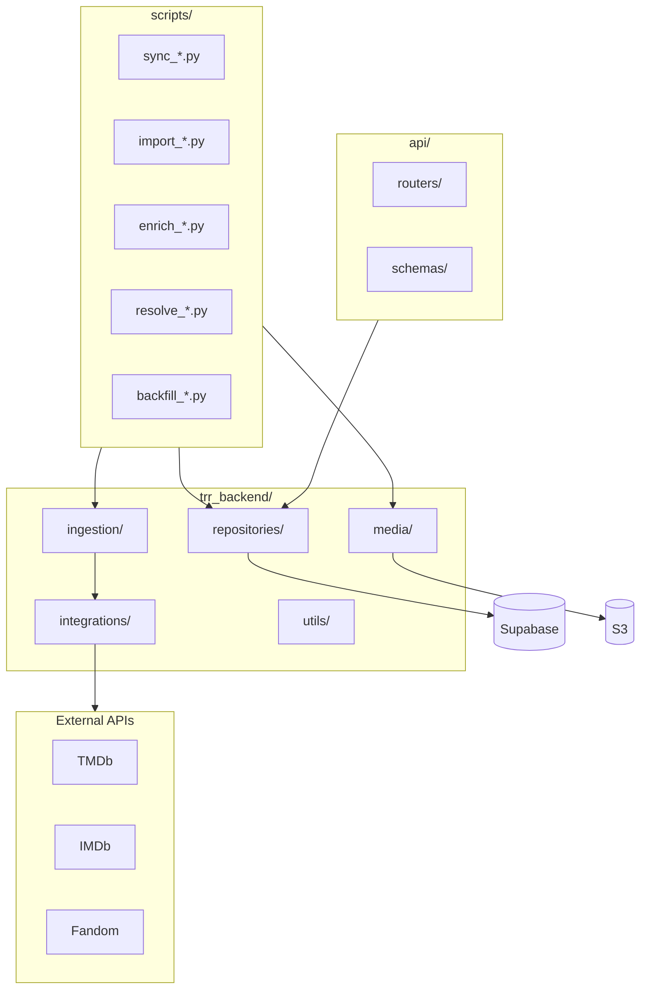
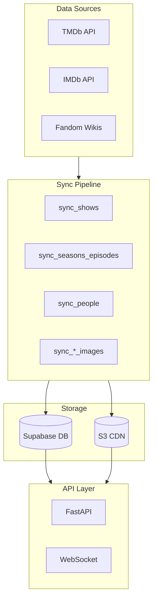
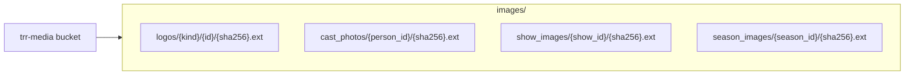

# System Architecture Maps

## Module Boundaries

## TMDb Enrichment Pipeline

## Data Flow Overview

## S3 Media Storage Layout

All media is content-addressed using SHA256 hashes for deduplication and immutable caching.
