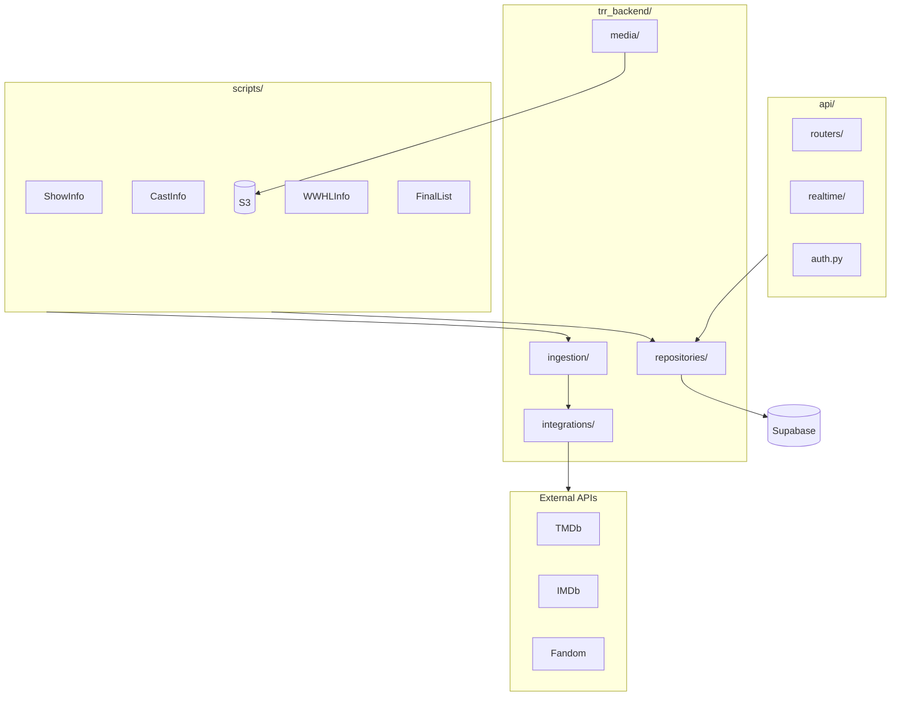
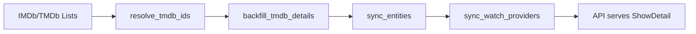

# System Architecture Maps

## Module Boundaries

## Data Flow

## Key Components

- **scripts/**: Data ingestion and enrichment pipelines
- **api/**: FastAPI REST endpoints and WebSocket realtime
- **trr_backend/**: Core business logic and data access
- **integrations/**: External API clients (TMDb, IMDb, etc.)
