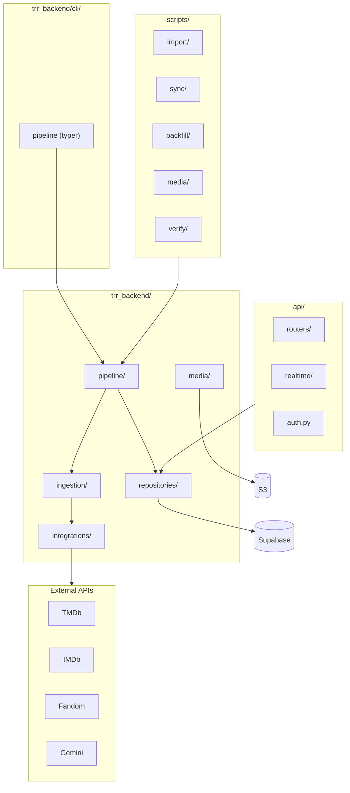
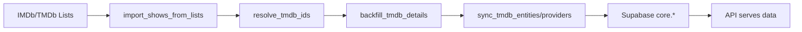

# System Architecture Maps

## Module Boundaries

```mermaid
flowchart TB
    subgraph scripts["scripts/"]
        import_scripts["import/"]
        sync_scripts["sync/"]
        backfill_scripts["backfill/"]
        media_scripts["media/"]
        verify_scripts["verify/"]
    end

    subgraph cli["trr_backend/cli/"]
        pipeline_cli["pipeline (typer)"]
    end

    subgraph api["api/"]
        routers["routers/"]
        realtime["realtime/"]
        auth["auth.py"]
    end

    subgraph trr["trr_backend/"]
        repos["repositories/"]
        integrations["integrations/"]
        ingestion["ingestion/"]
        pipeline["pipeline/"]
        media["media/"]
    end

    subgraph external["External APIs"]
        tmdb["TMDb"]
        imdb["IMDb"]
        fandom["Fandom"]
        gemini["Gemini"]
    end

    pipeline_cli --> pipeline
    scripts --> pipeline
    pipeline --> repos
    pipeline --> ingestion
    api --> repos
    ingestion --> integrations
    integrations --> external
    repos --> db[(Supabase)]
    media --> s3[(S3)]
```

## Data Flow

```mermaid
flowchart LR
    lists["IMDb/TMDb Lists"] --> import["import_shows_from_lists"]
    import --> resolve["resolve_tmdb_ids"]
    resolve --> enrich["backfill_tmdb_details"]
    enrich --> providers["sync_tmdb_entities/providers"]
    providers --> db["Supabase core.*"]
    db --> api["API serves data"]
```

## Key Components

- **scripts/**: Data ingestion and enrichment pipelines
- **trr_backend/pipeline/**: Orchestrated, resumable pipeline stages
- **trr_backend/cli/**: CLI entrypoints (Typer)
- **api/**: FastAPI REST endpoints and WebSocket realtime
- **integrations/**: External API clients (TMDb, IMDb, etc.)
