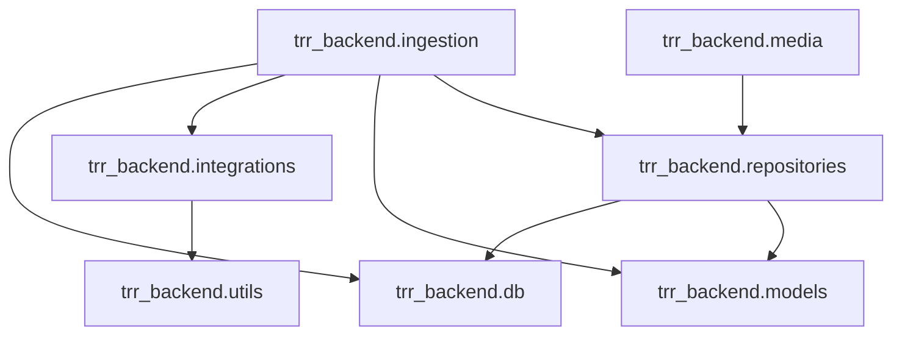

# trr_backend Internal Import Graph

```mermaid
flowchart TB
    n0["trr_backend.db"]
    n1["trr_backend.ingestion"]
    n2["trr_backend.integrations"]
    n3["trr_backend.media"]
    n4["trr_backend.models"]
    n5["trr_backend.repositories"]
    n6["trr_backend.utils"]

    n1 --> n0
    n1 --> n2
    n1 --> n4
    n1 --> n5
    n2 --> n6
    n3 --> n5
    n5 --> n0
    n5 --> n4
```
