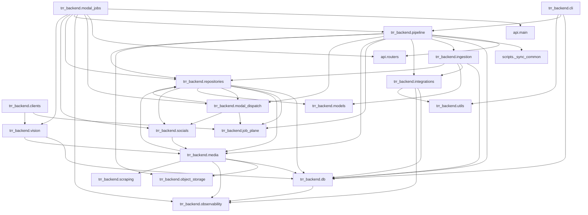

# trr_backend Internal Import Graph

```mermaid
flowchart TB
    n0["api.main"]
    n1["api.routers"]
    n2["scripts._sync_common"]
    n3["trr_backend.cli"]
    n4["trr_backend.clients"]
    n5["trr_backend.db"]
    n6["trr_backend.ingestion"]
    n7["trr_backend.integrations"]
    n8["trr_backend.job_plane"]
    n9["trr_backend.media"]
    n10["trr_backend.modal_dispatch"]
    n11["trr_backend.modal_jobs"]
    n12["trr_backend.models"]
    n13["trr_backend.object_storage"]
    n14["trr_backend.observability"]
    n15["trr_backend.pipeline"]
    n16["trr_backend.repositories"]
    n17["trr_backend.scraping"]
    n18["trr_backend.socials"]
    n19["trr_backend.utils"]
    n20["trr_backend.vision"]

    n3 --> n5
    n3 --> n15
    n3 --> n19
    n4 --> n8
    n4 --> n20
    n5 --> n14
    n6 --> n5
    n6 --> n7
    n6 --> n12
    n6 --> n16
    n7 --> n5
    n7 --> n14
    n7 --> n19
    n9 --> n5
    n9 --> n13
    n9 --> n14
    n9 --> n16
    n9 --> n17
    n10 --> n8
    n10 --> n16
    n10 --> n18
    n11 --> n0
    n11 --> n1
    n11 --> n10
    n11 --> n14
    n11 --> n15
    n11 --> n16
    n11 --> n18
    n11 --> n20
    n15 --> n1
    n15 --> n2
    n15 --> n5
    n15 --> n6
    n15 --> n7
    n15 --> n8
    n15 --> n9
    n15 --> n10
    n15 --> n13
    n15 --> n16
    n16 --> n5
    n16 --> n8
    n16 --> n9
    n16 --> n10
    n16 --> n12
    n16 --> n18
    n18 --> n9
    n20 --> n5
    n20 --> n9
```
