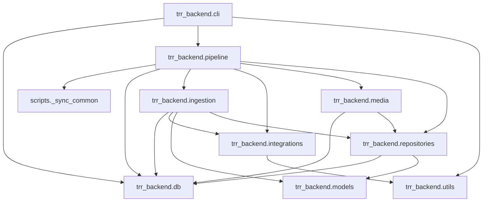

# trr_backend Internal Import Graph

```mermaid
flowchart TB
    n0["scripts._sync_common"]
    n1["trr_backend.cli"]
    n2["trr_backend.db"]
    n3["trr_backend.ingestion"]
    n4["trr_backend.integrations"]
    n5["trr_backend.media"]
    n6["trr_backend.models"]
    n7["trr_backend.pipeline"]
    n8["trr_backend.repositories"]
    n9["trr_backend.utils"]

    n1 --> n2
    n1 --> n7
    n1 --> n9
    n3 --> n2
    n3 --> n4
    n3 --> n6
    n3 --> n8
    n4 --> n9
    n5 --> n2
    n5 --> n8
    n7 --> n0
    n7 --> n2
    n7 --> n3
    n7 --> n4
    n7 --> n5
    n7 --> n8
    n8 --> n2
    n8 --> n6
```
