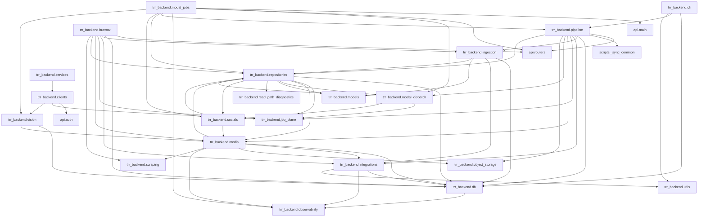

# trr_backend Internal Import Graph

```mermaid
flowchart TB
    n0["api.auth"]
    n1["api.main"]
    n2["api.routers"]
    n3["scripts._sync_common"]
    n4["trr_backend.bravotv"]
    n5["trr_backend.cli"]
    n6["trr_backend.clients"]
    n7["trr_backend.db"]
    n8["trr_backend.ingestion"]
    n9["trr_backend.integrations"]
    n10["trr_backend.job_plane"]
    n11["trr_backend.media"]
    n12["trr_backend.modal_dispatch"]
    n13["trr_backend.modal_jobs"]
    n14["trr_backend.models"]
    n15["trr_backend.object_storage"]
    n16["trr_backend.observability"]
    n17["trr_backend.pipeline"]
    n18["trr_backend.read_path_diagnostics"]
    n19["trr_backend.repositories"]
    n20["trr_backend.scraping"]
    n21["trr_backend.services"]
    n22["trr_backend.socials"]
    n23["trr_backend.utils"]
    n24["trr_backend.vision"]

    n4 --> n2
    n4 --> n7
    n4 --> n8
    n4 --> n9
    n4 --> n10
    n4 --> n11
    n4 --> n19
    n4 --> n20
    n5 --> n7
    n5 --> n17
    n5 --> n23
    n6 --> n0
    n6 --> n10
    n6 --> n24
    n7 --> n16
    n8 --> n7
    n8 --> n9
    n8 --> n14
    n8 --> n19
    n9 --> n7
    n9 --> n16
    n9 --> n23
    n11 --> n7
    n11 --> n9
    n11 --> n15
    n11 --> n16
    n11 --> n19
    n11 --> n20
    n12 --> n10
    n12 --> n19
    n12 --> n22
    n13 --> n1
    n13 --> n2
    n13 --> n12
    n13 --> n16
    n13 --> n17
    n13 --> n19
    n13 --> n22
    n13 --> n24
    n17 --> n2
    n17 --> n3
    n17 --> n7
    n17 --> n8
    n17 --> n9
    n17 --> n10
    n17 --> n11
    n17 --> n12
    n17 --> n15
    n17 --> n19
    n19 --> n7
    n19 --> n10
    n19 --> n11
    n19 --> n12
    n19 --> n14
    n19 --> n18
    n19 --> n22
    n21 --> n6
    n22 --> n11
    n22 --> n19
    n24 --> n7
    n24 --> n11
```
