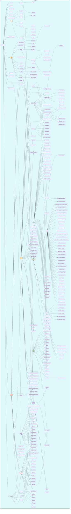

# Mermaid Diagram

```mermaid
graph TD
    %% Repository Structure
    subgraph trr_backend
        backend[trr-backend]
        backend --> env[.env.example]
        backend --> github[.github]
        github --> workflows[workflows]
        workflows --> ci[ci.yml]
        workflows --> repo_map[repo_map.yml]
        backend --> gitignore[.gitignore]
        backend --> python_version[.python-version]
        backend --> makefile[Makefile]
        backend --> readme[README.md]
        backend --> repo_structure[REPO_STRUCTURE.md]
        backend --> api[api]
        api --> init[__init__.py]
        api --> auth[auth.py]
        api --> deps[deps.py]
        api --> main[main.py]
        api --> realtime[realtime]
        realtime --> init_r[__init__.py]
        realtime --> broker[broker.py]
        realtime --> events[events.py]
        api --> routers[routers]
        routers --> init_r2[__init__.py]
        routers --> discussions[discussions.py]
        routers --> dms[dms.py]
        routers --> shows[shows.py]
        routers --> surveys[surveys.py]
        routers --> ws[ws.py]
        backend --> backfill_tmdb_show_details[backfill_tmdb_show_details.py]
        backend --> docs[docs]
        docs --> history_purge[HISTORY_PURGE.md]
        docs --> readme_local[README_local.md]
        docs --> repo[Repository]
        repo --> readme_repo[README.md]
        repo --> diagrams[diagrams]
        diagrams --> git_workflow[git_workflow.md]
        diagrams --> system_maps[system_maps.md]
        repo --> generated[generated]
        generated --> gitkeep[.gitkeep]
        generated --> code_import_graph[CODE_IMPORT_GRAPH.md]
        generated --> repo_structure_gen[REPO_STRUCTURE.md]
        generated --> repo_structure_mermaid[REPO_STRUCTURE.mermaid.md]
        generated --> scripts_flow[SCRIPTS_FLOW.md]
        docs --> sheet_edit_mapping[SHEET_EDIT_MAPPING.md]
        docs --> api_run[api]
        api_run --> run[run.md]
        docs --> architecture[architecture]
        architecture --> integrations[integrations.md]
        docs --> architecture_md[architecture.md]
        docs --> cloud[cloud]
        cloud --> cloud_setup[cloud_setup.md]
        cloud --> quick_setup[quick_cloud_setup.md]
        cloud --> setup_credentials[setup_codespaces_credentials.md]
        docs --> db[db]
        db --> commands[commands.md]
        db --> schema[schema.md]
        db --> verification[verification.md]
        docs --> images[images]
        images --> debug_imdb[debug_imdb_credits.png]
        docs --> runbooks[runbooks]
        runbooks --> show_import_job[show_import_job.md]
        backend --> pytest[pytest.ini]
        backend --> requirements[requirements.txt]
        backend --> resolve_tmdb_ids[resolve_tmdb_ids_via_find.py]
        backend --> scripts[scripts]
        scripts --> step1[1-ShowInfo]
        step1 --> readme_step1[README.md]
        step1 --> showinfo_step1[showinfo_step1.py]
        scripts --> step2[2-CastInfo]
        step2 --> castinfo_archive[CastInfo_ArchiveStep.py]
        step2 --> castinfo_step1[CastInfo_Step1.py]
        step2 --> castinfo_step2[CastInfo_Step2.py]
        step2 --> readme_step2[README.md]
        scripts --> step3[3-RealiteaseInfo]
        step3 --> readme_step3[README.md]
        step3 --> backfill[RealiteaseInfo_BackfillTMDb.py]
        step3 --> step1[RealiteaseInfo_Step1.py]
        step3 --> step2[RealiteaseInfo_Step2.py]
        step3 --> step3[RealiteaseInfo_Step3.py]
        step3 --> step4[RealiteaseInfo_Step4.py]
        step3 --> archive[RealiteaseInfo_archive.py]
        step3 --> birthdays_archive[realiteaseinfo_birthdays_archive.py]
        step3 --> scraper[ultimate_reality_tv_scraper.py]
        scripts --> step4[4-WWHLInfo]
        step4 --> readme_step4[README.md]
        step4 --> step4_script[WWHLInfo_Checker_Step4.py]
        step4 --> step3_script[WWHLInfo_Gemini_Step3.py]
        step4 --> step2_script[WWHLInfo_IMDb_Step2.py]
        step4 --> step1_script[WWHLInfo_TMDb_Step1.py]
        scripts --> step5[5-FinalList]
        step5 --> step1_final[FinalInfo_Step1.py]
        step5 --> step2_final[FinalInfo_Step2.py]
        step5 --> step3_final[FinalInfo_Step3.py]
        step5 --> final_list_builder[FinalList_Builder.py]
        step5 --> firebase_uploader[Firebase_Uploader.py]
        step5 --> verify_snapshot[verify_finallist_snapshot.py]
        scripts --> media[Media]
        media --> readme_media[README.md]
        scripts --> readme_scripts[README.md]
        scripts --> realiteaseinfo[RealiteaseInfo]
        realiteaseinfo --> readme_real[README.md]
        scripts --> sync_common[_sync_common.py]
        scripts --> archives[archives]
        archives --> add_tmdb_cast[add_tmdb_cast_ids.py]
        archives --> add_tmdb_ids[add_tmdb_ids_batch.py]
        archives --> build_realitease[build_realitease_info.py]
        archives --> enhance_bio[enhance_realitease_bio_data.py]
        archives --> enhance_birthdays[enhance_realitease_famous_birthdays.py]
        archives --> fetch_whhl[fetch_WWHL_info.py]
        archives --> fetch_whhl_clean[fetch_WWHL_info_clean.py]
        archives --> fetch_whhl_imdb[fetch_WWHL_info_imdb_api.py]
        archives --> fetch_whhl_chatgpt[fetch_WWHL_info_imdb_chatgpt.py]
        archives --> fetch_whhl_fast[fetch_WWHL_info_imdb_fast.py]
        archives --> fetch_missing_person[fetch_missing_person_info.py]
        archives --> fetch_person_details[fetch_person_details.py]
        archives --> find_missing_cast[find_missing_cast_selective.py]
        archives --> smart_filter[smart_cast_filter.py]
        archives --> test_new_structure[test_new_structure.py]
        archives --> test_update[test_update.py]
        archives --> api_test[tmdb_api_test_no_key.py]
        archives --> corrected_extractor[tmdb_corrected_extractor.py]
        archives --> credit_id_test[tmdb_credit_id_test.py]
        archives --> episode_details[tmdb_episode_details.py]
        archives --> extractor_v6[tmdb_extractor_v6.py]
        archives --> final_extractor[tmdb_final_extractor.py]
        archives --> focused_extractor[tmdb_focused_extractor.py]
        archives --> imdb_conversion_test[tmdb_imdb_conversion_test.py]
        archives --> other_shows_extractor[tmdb_other_shows_extractor.py]
        archives --> quick_test[tmdb_quick_test.py]
        archives --> rupaul_extractor[tmdb_rupaul_extractor.py]
        archives --> season_extractor_test[tmdb_season_extractor_test.py]
        archives --> simple_test[tmdb_simple_test.py]
        scripts --> tmdb_show_details[backfill_tmdb_show_details.py]
        scripts --> db[db]
        db --> readme_db[README.md]
        db --> guard_core[guard_core_schema.sql]
        db --> reload[reload_postgrest_schema.sql]
        db --> run_sql[run_sql.sh]
        db --> verify_pre[verify_pre_0033_cleanup.sql]
        scripts --> enrich_show_cast[enrich_show_cast.py]
        scripts --> generate_repo_mermaid[generate_repo_mermaid.py]
        scripts --> imdb_show_enrichment[imdb_show_enrichment.py]
        scripts --> import_fandom_photos[import_fandom_gallery_photos.py]
        scripts --> imdb_cast_appearances[import_imdb_cast_episode_appearances.py]
        scripts --> import_shows[import_shows_from_lists.py]
        scripts --> mirror_cast_photos[mirror_cast_photos_to_s3.py]
        scripts --> mirror_show_images[mirror_show_images_to_s3.py]
        scripts --> rebuild_urls[rebuild_hosted_urls.py]
        scripts --> resolve_tmdb_ids[resolve_tmdb_ids_via_find.py]
        scripts --> fandom_enrichment[rhoslc_fandom_enrichment.py]
        scripts --> run_pipeline[run_pipeline.py]
        scripts --> show_import_job[run_show_import_job.py]
        scripts --> supabase[supabase]
        supabase --> generate_schema[generate_schema_docs.py]
        backend --> test_connection[test_connection.py]
        backend --> tests[tests]
        tests --> init_t[__init__.py]
        tests --> fixtures[fixtures]
        fixtures --> fandom[fandom]
        fandom --> lisa_barlow_infobox[lisa_barlow_infobox.html]
        fandom --> lisa_barlow_person[lisa_barlow_person_sample.html]
        fixtures --> imdb[imdb]
        imdb --> episode_overview_one[episodes_page_overview_one_season_sample.html]
        imdb --> episode_overview[episodes_page_overview_sample.html]
        imdb --> episode_season1_next[episodes_page_season1_next_data_sample.html]
        imdb --> episode_season3[episodes_page_season3_sample.html]
        imdb --> fullcredits_cast[fullcredits_cast_sample.html]
        imdb --> list_html_fallback[list_html_fallback_sample.html]
        imdb --> list_jsonld[list_jsonld_sample.html]
        imdb --> list_sample[list_sample.html]
        imdb --> list_sample_page2[list_sample_page2.html]
        imdb --> mediaindex_sample[mediaindex_tt8819906_sample.html]
        imdb --> viewer_graphql_sample[mediaindex_viewer_graphql_tt8819906_sample.html]
        imdb --> person_mediaindex[person_mediaindex_nm11883948_sample.html]
        imdb --> person_mediaviewer[person_mediaviewer_nm11883948_rm1679992066_sample.html]
        imdb --> section_images[section_images_sample.html]
        imdb --> title_list_main[title_list_main_page_sample.json]
        imdb --> title_page[title_page_sample.html]
        imdb --> title_page_tt[title_page_tt8819906_sample.html]
        fixtures --> tmdb[tmdb]
        tmdb --> find_by_imdb_id[find_by_imdb_id_sample.json]
        tmdb --> tv_details_full[tv_details_full_sample.json]
        tmdb --> tv_details[tv_details_sample.json]
        tmdb --> tv_images[tv_images_sample.json]
        tmdb --> tv_season_details[tv_season_details_sample.json]
        tmdb --> tv_watch_providers[tv_watch_providers_sample.json]
        tests --> ingestion[ingestion]
        ingestion --> test_episode_appearances[test_episode_appearances_upsert.py]
        ingestion --> test_fandom_person[test_fandom_person_scraper.py]
        ingestion --> test_show_import_metadata[test_show_importer_metadata_enrichment.py]
        ingestion --> test_show_import_tmdb[test_show_importer_tmdb_details_links_imdb_show.py]
        ingestion --> test_show_metadata_enricher[test_show_metadata_enricher.py]
        ingestion --> test_tmdb_show_backfill[test_tmdb_show_backfill.py]
        tests --> integrations[integrations]
        integrations --> fandom[fandom]
        fandom --> test_fandom_infobox[test_fandom_infobox_parser.py]
        integrations --> imdb[imdb]
        imdb --> test_episodic_client[test_episodic_client_normalization.py]
        imdb --> test_fullcredits_cast[test_fullcredits_cast_parser.py]
        imdb --> test_imdb_episodes[test_imdb_episodes_persistence.py]
        imdb --> test_imdb_images[test_imdb_images.py]
        imdb --> test_list_graphql[test_imdb_list_graphql_client_parsing.py]
        imdb --> test_mediaindex[test_mediaindex_images.py]
        imdb --> test_person_gallery[test_person_gallery_parser.py]
        imdb --> test_title_metadata[test_title_page_metadata.py]
        tests --> tmdb[tmdb]
        tmdb --> test_tmdb_season_enrichment[test_tmdb_season_enrichment.py]
        tmdb --> test_tmdb_tv_details[test_tmdb_tv_details_persistence.py]
        tmdb --> test_tmdb_tv_images[test_tmdb_tv_images_persistence.py]
        tests --> media[media]
        media --> test_s3_mirror[test_s3_mirror.py]
        tests --> migrations[migrations]
        migrations --> test_show_source_metadata[test_show_source_metadata_migrations.py]
        tests --> repositories[repositories]
        repositories --> test_cast_photos_upsert[test_cast_photos_upsert.py]
        repositories --> test_pgrst204_retry[test_pgrst204_retry.py]
        repositories --> test_shows_preflight[test_shows_preflight.py]
        tests --> scripts[scripts]
        scripts --> test_import_shows_from_lists_merge[test_import_shows_from_lists_merge.py]
        scripts --> test_import_shows_from_lists_parsing[test_import_shows_from_lists_parsing.py]
        scripts --> test_import_shows_from_lists_upsert[test_import_shows_from_lists_upsert.py]
        scripts --> test_sync_incremental[test_sync_incremental.py]
        scripts --> test_sync_tmdb_watch_providers[test_sync_tmdb_watch_providers.py]
        tests --> test_api_smoke[test_api_smoke.py]
        tests --> test_discussions_smoke[test_discussions_smoke.py]
        tests --> test_dms_smoke[test_dms_smoke.py]
        tests --> test_ws_realtime_smoke[test_ws_realtime_smoke.py]
        tests --> utils[utils]
        utils --> test_episode_appearances[test_episode_appearances_aggregation.py]
        backend --> backend_dir[trr_backend]
        backend_dir --> init_backend[__init__.py]
        backend_dir --> db[db]
        db --> init_db[__init__.py]
        db --> connection[connection.py]
        db --> postgrest_cache[postgrest_cache.py]
        db --> preflight[preflight.py]
        db --> show_images[show_images.py]
        db --> supabase[supabase.py]
        backend_dir --> ingestion[ingestion]
        ingestion --> init_ingestion[__init__.py]
        ingestion --> cast_photo_sources[cast_photo_sources.py]
        ingestion --> fandom_person_scraper[fandom_person_scraper.py]
        ingestion --> imdb_images[imdb_images.py]
        ingestion --> show_importer[show_importer.py]
        ingestion --> show_metadata_enricher[show_metadata_enricher.py]
        ingestion --> showinfo_overrides[showinfo_overrides.py]
        ingestion --> shows_from_lists[shows_from_lists.py]
        ingestion --> tmdb_person_images[tmdb_person_images.py]
        ingestion --> tmdb_show_backfill[tmdb_show_backfill.py]
        backend_dir --> integrations[integrations]
        integrations --> init_integrations[__init__.py]
        integrations --> fandom[fandom.py]
        integrations --> imdb[imdb]
        imdb --> init_imdb[__init__.py]
        imdb --> credits_client[credits_client.py]
        imdb --> episodic_client[episodic_client.py]
        imdb --> fullcredits_cast_parser[fullcredits_cast_parser.py]
        imdb --> list_graphql_client[list_graphql_client.py]
        imdb --> mediaindex_images[mediaindex_images.py]
        imdb --> person_gallery[person_gallery.py]
        imdb --> title_metadata_client[title_metadata_client.py]
        imdb --> title_page_metadata[title_page_metadata.py]
        integrations --> tmdb[tmdb]
        tmdb --> init_tmdb[__init__.py]
        tmdb --> client[client.py]
        integrations --> tmdb_person[tmdb_person.py]
        backend_dir --> media[media]
        media --> init_media[__init__.py]
        media --> s3_mirror[s3_mirror.py]
        backend_dir --> models[models]
        models --> init_models[__init__.py]
        models --> cast_photos[cast_photos.py]
        models --> shows[shows.py]
        backend_dir --> repositories[repositories]
        repositories --> init_repositories[__init__.py]
        repositories --> cast_fandom[cast_fandom.py]
        repositories --> cast_photos[cast_photos.py]
        repositories --> cast_tmdb[cast_tmdb.py]
        repositories --> episode_appearances[episode_appearances.py]
        repositories --> episodes[episodes.py]
        repositories --> imdb_series[imdb_series.py]
        repositories --> people[people.py]
        repositories --> season_images[season_images.py]
        repositories --> seasons[seasons.py]
        repositories --> show_cast[show_cast.py]
        repositories --> show_images[show_images.py]
        repositories --> shows[shows.py]
        repositories --> sync_state[sync_state.py]
        repositories --> tmdb_series[tmdb_series.py]
        backend_dir --> utils[utils]
        utils --> init_utils[__init__.py]
        utils --> env[env.py]
        utils --> episode_appearances[episode_appearances.py]
    end
    style trr_backend fill:#e0f7fa,stroke:#333,stroke-width:2px;
    style api fill:#fff3e0,stroke:#333,stroke-width:1px;
    style docs fill:#ffe0b2,stroke:#333,stroke-width:1px;
    style scripts fill:#ffe0b2,stroke:#333,stroke-width:1px;
    style tests fill:#ffccbc,stroke:#333,stroke-width:1px;
    style backend_dir fill:#e0f2f1,stroke:#333,stroke-width:1px;
    style integrations fill:#f1f8e9,stroke:#333,stroke-width:1px;
    style repositories fill:#fce4ec,stroke:#333,stroke-width:1px;
    style media fill:#d1c4e9,stroke:#333,stroke-width:1px;
    style db fill:#c8e6c9,stroke:#333,stroke-width:1px;
```