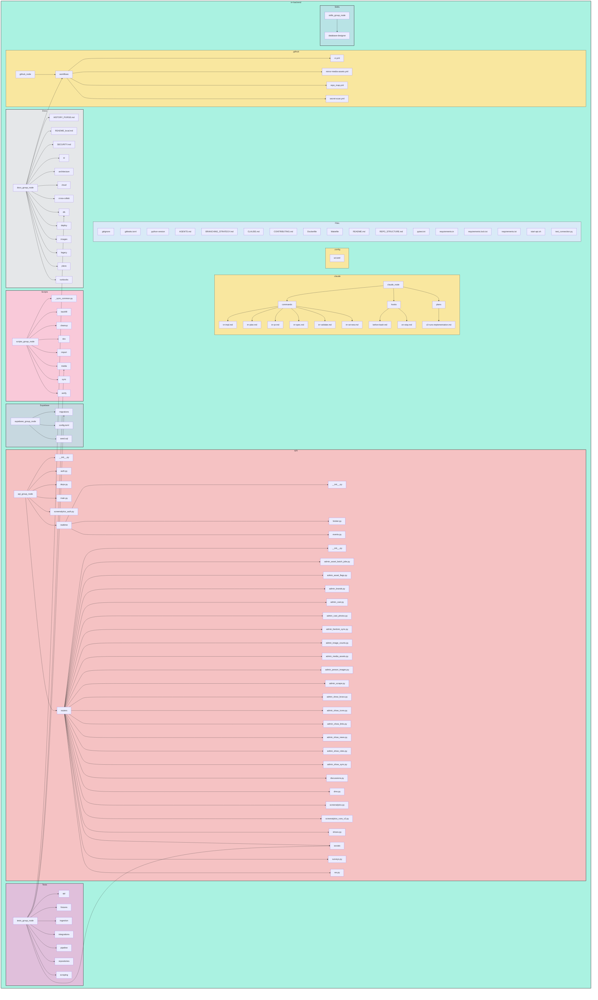

# Mermaid Diagram

```mermaid
graph TD
    %% Repository Structure
    subgraph trr_backend["trr-backend"]
        style trr_backend fill:#aaf2e1,stroke:#333,stroke-width:2px;
        
        subgraph claude[".claude"]
            style claude fill:#f9e79f,stroke:#333,stroke-width:1px;
            claude_commands[commands]
            claude_hooks[hooks]
            claude_plans[plans]
            claude_node --> claude_commands
            claude_node --> claude_hooks
            claude_node --> claude_plans
            claude_commands --> trr_impl[trr-impl.md]
            claude_commands --> trr_plan[trr-plan.md]
            claude_commands --> trr_pr[trr-pr.md]
            claude_commands --> trr_spec[trr-spec.md]
            claude_commands --> trr_validate[trr-validate.md]
            claude_commands --> trr_wt_new[trr-wt-new.md]
            claude_hooks --> before_bash[before-bash.md]
            claude_hooks --> on_stop[on-stop.md]
            claude_plans --> v2_runs[v2-runs-implementation.md]
        end
        
        subgraph config[".config"]
            style config fill:#f9e79f,stroke:#333,stroke-width:1px;
            wt_toml[wt.toml]
        end
        
        subgraph github[".github"]
            style github fill:#f9e79f,stroke:#333,stroke-width:1px;
            workflows[workflows]
            github_node --> workflows
            workflows --> ci[ci.yml]
            workflows --> mirror_media[mirror-media-assets.yml]
            workflows --> repo_map[repo_map.yml]
            workflows --> secret_scan[secret-scan.yml]
        end
        
        subgraph files["Files"]
            style files fill:#d9eaf7,stroke:#333,stroke-width:1px;
            gitignore[.gitignore]
            gitleaks[.gitleaks.toml]
            python_version[.python-version]
            agents[AGENTS.md]
            branching_strategy[BRANCHING_STRATEGY.md]
            claude_doc[CLAUDE.md]
            contributing[CONTRIBUTING.md]
            dockerfile[Dockerfile]
            makefile[Makefile]
            readme[README.md]
            repo_structure[REPO_STRUCTURE.md]
            pytest_ini[pytest.ini]
            requirements_in[requirements.in]
            requirements_lock[requirements.lock.txt]
            requirements[requirements.txt]
            start_api[start-api.sh]
            test_connection[test_connection.py]
        end
        
        subgraph api_group["API"]
            style api_group fill:#f5c2c3,stroke:#333,stroke-width:2px;
            init[__init__.py]
            auth[auth.py]
            deps[deps.py]
            main[main.py]
            screenalytics_auth[screenalytics_auth.py]
            realtime[realtime]
            routers[routers]
            api_group_node --> init
            api_group_node --> auth
            api_group_node --> deps
            api_group_node --> main
            api_group_node --> screenalytics_auth
            api_group_node --> realtime
            api_group_node --> routers
            realtime --> init_realtime[__init__.py]
            realtime --> broker[broker.py]
            realtime --> events[events.py]
            routers --> init_routers[__init__.py]
            routers --> admin_asset_batch_jobs[admin_asset_batch_jobs.py]
            routers --> admin_asset_flags[admin_asset_flags.py]
            routers --> admin_brands[admin_brands.py]
            routers --> admin_cast[admin_cast.py]
            routers --> admin_cast_photos[admin_cast_photos.py]
            routers --> admin_fandom_sync[admin_fandom_sync.py]
            routers --> admin_image_counts[admin_image_counts.py]
            routers --> admin_media_assets[admin_media_assets.py]
            routers --> admin_person_images[admin_person_images.py]
            routers --> admin_scrape[admin_scrape.py]
            routers --> admin_show_bravo[admin_show_bravo.py]
            routers --> admin_show_icons[admin_show_icons.py]
            routers --> admin_show_links[admin_show_links.py]
            routers --> admin_show_news[admin_show_news.py]
            routers --> admin_show_roles[admin_show_roles.py]
            routers --> admin_show_sync[admin_show_sync.py]
            routers --> discussions[discussions.py]
            routers --> dms[dms.py]
            routers --> screenalytics[screenalytics.py]
            routers --> screenalytics_runs_v2[screenalytics_runs_v2.py]
            routers --> shows[shows.py]
            routers --> socials[socials.py]
            routers --> surveys[surveys.py]
            routers --> ws[ws.py]
        end

        subgraph docs_group["Docs"]
            style docs_group fill:#e5e7e9,stroke:#333,stroke-width:2px;
            history_purge[HISTORY_PURGE.md]
            readme_local[README_local.md]
            security[SECURITY.md]
            ai[ai]
            architecture[architecture]
            cloud[cloud]
            cross_collab[cross-collab]
            db[db]
            deploy[deploy]
            images[images]
            legacy[legacy]
            plans[plans]
            runbooks[runbooks]
            workflows[workflows]
            docs_group_node --> history_purge
            docs_group_node --> readme_local
            docs_group_node --> security
            docs_group_node --> ai
            docs_group_node --> architecture
            docs_group_node --> cloud
            docs_group_node --> cross_collab
            docs_group_node --> db
            docs_group_node --> deploy
            docs_group_node --> images
            docs_group_node --> legacy
            docs_group_node --> plans
            docs_group_node --> runbooks
            docs_group_node --> workflows
        end

        subgraph scripts_group["Scripts"]
            style scripts_group fill:#f9c9d9,stroke:#333,stroke-width:2px;
            sync_common[_sync_common.py]
            backfill[backfill]
            cleanup[cleanup]
            dev[dev]
            import[import]
            media[media]
            sync[sync]
            verify[verify]
            scripts_group_node --> sync_common
            scripts_group_node --> backfill
            scripts_group_node --> cleanup
            scripts_group_node --> dev
            scripts_group_node --> import
            scripts_group_node --> media
            scripts_group_node --> sync
            scripts_group_node --> verify
        end

        subgraph supabase_group["Supabase"]
            style supabase_group fill:#c7d8e0,stroke:#333,stroke-width:2px;
            migrations[migrations]
            supabase_conf[config.toml]
            seed[seed.sql]
            supabase_group_node --> migrations
            supabase_group_node --> supabase_conf
            supabase_group_node --> seed
        end

        subgraph tests_group["Tests"]
            style tests_group fill:#e0bfdb,stroke:#333,stroke-width:2px;
            api[api]
            db[db]
            fixtures[fixtures]
            ingestion[ingestion]
            integrations[integrations]
            media[media]
            migrations[migrations]
            pipeline[pipeline]
            repositories[repositories]
            scraping[scraping]
            socials[socials]
            tests_group_node --> api
            tests_group_node --> db
            tests_group_node --> fixtures
            tests_group_node --> ingestion
            tests_group_node --> integrations
            tests_group_node --> media
            tests_group_node --> migrations
            tests_group_node --> pipeline
            tests_group_node --> repositories
            tests_group_node --> scraping
            tests_group_node --> socials
        end
        
        subgraph skills_group["Skills"]
            style skills_group fill:#b8e3e5,stroke:#333,stroke-width:2px;
            database_designer[database-designer]
            skills_group_node --> database_designer
        end
    end
```