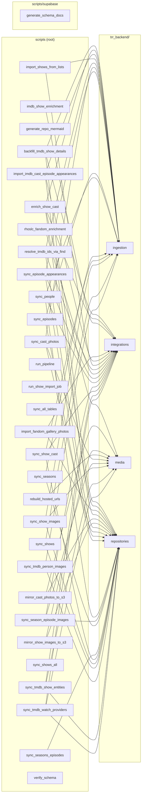

# Scripts Flow

Script entrypoints (`if __name__ == '__main__'`) and their trr_backend dependencies.

```mermaid
flowchart LR
    subgraph sg0["scripts (root)"]
        s0["backfill_tmdb_show_details"]
        s1["enrich_show_cast"]
        s2["generate_repo_mermaid"]
        s3["imdb_show_enrichment"]
        s4["import_fandom_gallery_photos"]
        s5["import_imdb_cast_episode_appearances"]
        s6["import_shows_from_lists"]
        s7["mirror_cast_photos_to_s3"]
        s8["mirror_show_images_to_s3"]
        s9["rebuild_hosted_urls"]
        s10["resolve_tmdb_ids_via_find"]
        s11["rhoslc_fandom_enrichment"]
        s12["run_pipeline"]
        s13["run_show_import_job"]
        s14["sync_all_tables"]
        s15["sync_cast_photos"]
        s16["sync_episode_appearances"]
        s17["sync_episodes"]
        s18["sync_people"]
        s19["sync_season_episode_images"]
        s20["sync_seasons"]
        s21["sync_seasons_episodes"]
        s22["sync_show_cast"]
        s23["sync_show_images"]
        s24["sync_shows"]
        s25["sync_shows_all"]
        s26["sync_tmdb_person_images"]
        s27["sync_tmdb_show_entities"]
        s28["sync_tmdb_watch_providers"]
        s29["verify_schema"]
    end
    subgraph sg1["scripts/supabase"]
        s30["generate_schema_docs"]
    end
    subgraph trr["trr_backend/"]
        ingestion["ingestion"]
        integrations["integrations"]
        media["media"]
        repos["repositories"]
    end
    s0 --> ingestion
    s0 --> integrations
    s0 --> repos
    s1 --> ingestion
    s1 --> integrations
    s1 --> media
    s1 --> repos
    s3 --> integrations
    s4 --> integrations
    s4 --> repos
    s5 --> ingestion
    s5 --> integrations
    s5 --> repos
    s6 --> ingestion
    s6 --> integrations
    s7 --> media
    s7 --> repos
    s8 --> media
    s8 --> repos
    s9 --> media
    s10 --> ingestion
    s10 --> integrations
    s10 --> repos
    s11 --> integrations
    s15 --> ingestion
    s15 --> media
    s15 --> repos
    s16 --> ingestion
    s16 --> integrations
    s16 --> repos
    s17 --> ingestion
    s17 --> repos
    s18 --> ingestion
    s18 --> integrations
    s18 --> repos
    s19 --> integrations
    s19 --> media
    s19 --> repos
    s20 --> ingestion
    s20 --> repos
    s21 --> repos
    s22 --> ingestion
    s22 --> integrations
    s22 --> repos
    s23 --> ingestion
    s23 --> media
    s23 --> repos
    s24 --> ingestion
    s24 --> repos
    s26 --> ingestion
    s26 --> repos
    s27 --> integrations
    s27 --> media
    s27 --> repos
    s28 --> integrations
    s28 --> media
    s28 --> repos
```
