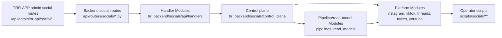

# Social Compatibility Wrapper Ledger

Purpose: track social architecture compatibility wrappers until callers move to
canonical Modules. This is an execution guide, not proof that wrappers have
already been removed.

Current Module flow:



Current extraction status:

- Backend live-status and ingest health-dot payload construction now lives in `trr_backend.socials.api.handlers.live_status`; `api/routers/socials/__init__.py` keeps only FastAPI route wiring and SSE streaming.
- Backend profile and catalog read route calls now pass through `trr_backend.socials.api.handlers.profile_reads`; the handler uses the canonical `trr_backend.socials.social_season_analytics_impl` module so existing repository-alias patch paths still work during the compatibility period.
- TRR-APP profile route reads use `apps/web/src/lib/server/trr-api/social-profile-route-factory.ts`; comments scrape now uses the same factory with cache invalidation and empty-body JSON fallback.
- No compatibility wrapper was deleted in this pass. The `rg` evidence below still shows supported callers or tests for each surviving wrapper group.

## Ledger

| Wrapper | Canonical owner | Remaining callers | Deletion condition | Validation | Owner |
| --- | --- | --- | --- | --- | --- |
| `trr_backend.repositories.social_season_analytics` | Current alias to `trr_backend.socials.social_season_analytics_impl`; extracted behavior should move to `control_plane`, `pipelines`, `read_models`, `api/handlers`, or platform Modules before deletion. | Large legacy surface: `api/routers/socials/__init__.py`, `trr_backend/repositories/social_sync_orchestrator.py`, platform job runners/persistence, operator scripts, and many tests still import or patch this path. | All supported runtime callers and tests import or patch canonical owners; repository shim is no longer needed for public/admin route compatibility. | `rg -n "repositories\\.social_season_analytics|repositories import social_season_analytics" trr_backend api tests scripts`; `pytest -q tests/repositories/test_social_control_plane_imports.py`. | Backend social architecture |
| `trr_backend.socials.instagram.comments_control` | `trr_backend.socials.pipelines.comments.instagram` | Import guard tests and comments-auth tests still import the old control path. The module aliases the pipeline owner so monkeypatches hit the executable owner. | Tests and remaining callers patch/import `trr_backend.socials.pipelines.comments.instagram` directly. | `rg -n "instagram\\.comments_control|from trr_backend\\.socials\\.instagram import comments_control" trr_backend api tests scripts`; comments scrape launch/progress/cancel tests. | Instagram comments pipeline |
| `trr_backend.socials.instagram.posts_control` | Current owner for Instagram posts-scrapling launch helpers; intended target is a dedicated posts-scrapling control/launch Module before this becomes deleteable. | `social_season_analytics_impl.py` imports `_LOCAL_ROOM_FUNCTIONS`; import guard tests assert current ownership. | Posts-scrapling launch helpers have a canonical non-wrapper owner and the legacy core no longer imports `_LOCAL_ROOM_FUNCTIONS` from this path. | `rg -n "instagram\\.posts_control|from trr_backend\\.socials\\.instagram import posts_control" trr_backend api tests scripts`; posts-scrapling start and worker-lane tests. | Instagram posts pipeline |
| `trr_backend.socials.account_catalog.catalog_launch` | `trr_backend.socials.pipelines.account_catalog.launch` | `control_plane/dispatch.py`, `social_season_analytics_impl.py`, and import guard tests still import the compatibility path. | Control plane and legacy-core callers import `pipelines.account_catalog.launch` directly; tests patch the pipeline owner. | `rg -n "account_catalog\\.catalog_launch" trr_backend api tests scripts`; account-catalog backfill launch tests. | Account catalog pipeline |
| `trr_backend.socials.account_catalog.catalog_progress` | `trr_backend.socials.pipelines.account_catalog.progress` | `social_season_analytics_impl.py` and import guard tests still import the compatibility path. | Progress route/tests import `pipelines.account_catalog.progress` directly and wrapper search is empty. | `rg -n "account_catalog\\.catalog_progress" trr_backend api tests scripts`; catalog progress route tests. | Account catalog pipeline |
| `trr_backend.socials.account_catalog.profile_reads` | `trr_backend.socials.read_models.account_profile.common` | `social_season_analytics_impl.py` and import guard tests still import the compatibility path. | Profile read routes/tests import `read_models.account_profile.common` directly and wrapper search is empty. | `rg -n "account_catalog\\.profile_reads" trr_backend api tests scripts`; profile summary/posts/comments/hashtags tests. | Account profile read models |
| `trr_backend.socials.account_catalog` package root | `trr_backend.socials.pipelines.account_catalog` and `trr_backend.socials.read_models.account_profile.common` | Kept as a package-level bridge for old `account_catalog` imports. | Direct submodule wrappers above are gone or package root is no longer imported outside compatibility tests. | `rg -n "trr_backend\\.socials\\.account_catalog|from trr_backend\\.socials\\.account_catalog" trr_backend api tests scripts`. | Account catalog pipeline |
| `_scrape_shared_twitter_posts()` in `trr_backend.socials.social_season_analytics_impl` | `trr_backend.socials.twitter.posts_catalog` | Shared-account catalog orchestration still enters through the legacy monolith wrapper. | Direct callers use `trr_backend.socials.twitter.posts_catalog.scrape_shared_twitter_posts`, and wrapper delegation tests are the only remaining wrapper references. | `rg -n "_scrape_shared_twitter_posts|twitter\\.posts_catalog" trr_backend api tests scripts`; Twitter posts catalog tests. | Twitter/X posts catalog |
| `_scrape_shared_facebook_posts()` in `trr_backend.socials.social_season_analytics_impl` | `trr_backend.socials.facebook.posts_catalog` | Shared-account catalog orchestration still enters through the legacy monolith wrapper. | Direct callers use `trr_backend.socials.facebook.posts_catalog.scrape_shared_facebook_posts`, and wrapper delegation tests are the only remaining wrapper references. | `rg -n "_scrape_shared_facebook_posts|facebook\\.posts_catalog" trr_backend api tests scripts`; Facebook posts catalog tests. | Facebook posts catalog |
| `_scrape_shared_threads_posts()` in `trr_backend.socials.social_season_analytics_impl` | `trr_backend.socials.threads.posts_catalog` | Shared-account catalog orchestration still enters through the legacy monolith wrapper; this is separate from the `threads_posts_scrapling` claimed-job lane. | Direct callers use `trr_backend.socials.threads.posts_catalog.scrape_shared_threads_posts`, and wrapper delegation tests are the only remaining wrapper references. | `rg -n "_scrape_shared_threads_posts|threads\\.posts_catalog" trr_backend api tests scripts`; Threads posts catalog tests. | Threads posts catalog |
| `_scrape_shared_youtube_posts()` in `trr_backend.socials.social_season_analytics_impl` | `trr_backend.socials.youtube.posts_catalog` | Shared-account catalog orchestration still enters through the legacy monolith wrapper. This is separate from direct `/youtube/scrape` behavior and script-visible comment/download helpers. | Direct callers use `trr_backend.socials.youtube.posts_catalog.scrape_shared_youtube_posts`, and wrapper diagnostics/delegation tests are the only remaining wrapper references. | `rg -n "_scrape_shared_youtube_posts|youtube\\.posts_catalog" trr_backend api tests scripts`; YouTube catalog diagnostics tests. | YouTube posts catalog |

## Wrapper Issue List

- `repositories.social_season_analytics`: cannot be deleted yet because route registration, scripts, platform runners, and tests still rely on the repository import and monkeypatch surface. Removal requires backend route handler extraction plus platform lifecycle/persistence imports moving to canonical owners.
- `instagram.comments_control`: cannot be deleted until tests and any comments-auth callers patch `pipelines.comments.instagram` directly.
- `instagram.posts_control`: cannot be deleted until posts-scrapling launch helpers move behind a clearer posts Module and legacy-core `_LOCAL_ROOM_FUNCTIONS` bridges are removed.
- `account_catalog.*`: cannot be deleted while `control_plane/dispatch.py` or `social_season_analytics_impl.py` imports compatibility submodules for launch, progress, or profile reads.
- `_scrape_shared_twitter_posts`, `_scrape_shared_facebook_posts`, `_scrape_shared_threads_posts`, and `_scrape_shared_youtube_posts`: cannot be deleted until shared-account catalog callers move to the platform-local posts catalog Modules. Twitter/X and Facebook should not grow claimed-job lanes as part of this cleanup.

## Current Wrapper Evidence

Run from `TRR-Backend`:

```bash
rg -n "comments_control|posts_control|account_catalog\\.catalog_launch|account_catalog\\.catalog_progress|account_catalog\\.profile_reads|repositories import social_season_analytics|repositories\\.social_season_analytics" trr_backend api tests scripts
rg -n "_scrape_shared_twitter_posts|_scrape_shared_facebook_posts|_scrape_shared_threads_posts|_scrape_shared_youtube_posts|twitter\\.posts_catalog|facebook\\.posts_catalog|threads\\.posts_catalog|youtube\\.posts_catalog" trr_backend api tests scripts
```

Expected result for this pass: non-empty output. The wrapper ledger remains open until that command is empty for a wrapper group or only points at the deletion test proving the wrapper is absent.

## Deletion Rules

- Delete a wrapper only when `rg` proves no supported runtime caller or test
  patch path remains.
- Keep route paths, payloads, scrape stages, job types, run statuses, worker
  lanes, and metadata keys unchanged.
- When a wrapper remains, update this ledger with caller evidence, owner, and a
  concrete removal condition.
- Record wrapper deletion evidence in the commit message for that wrapper group.

## Operator Smoke Checklist

Use this after social route/proxy/control-plane changes. The known local target
is `http://admin.localhost:3000/social/instagram/thetraitorsus`.

- Launch: start a profile catalog or comments scrape from the admin page and confirm the response includes a `run_id`, `status`, platform, account, and expected worker lane when applicable.
- Progress: poll the matching catalog or comments progress route and confirm counters, stage labels, `activity`, and degraded-progress fields are operator-readable.
- Cancel: cancel the launched run from the profile page or route and confirm the run moves toward `cancelled` without orphaning active jobs.
- Dashboard snapshot: refresh the profile page and confirm summary, posts, comments, hashtags, collaborators/tags, and catalog cards still load from the same app routes.
- Worker health: check ingest live status, queue status, and worker detail/purge surfaces for `queue_enabled`, worker health, lane readiness, and recent failures.
- Evidence: capture failing route, run id, job id, worker id, and backend error code before changing code or deleting wrappers.
