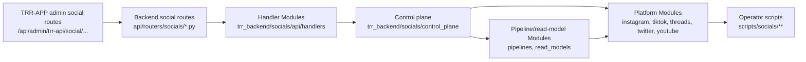

# Social Compatibility Wrapper Ledger

Purpose: track social architecture compatibility wrappers until callers move to
canonical Modules. This is an execution guide, not proof that wrappers have
already been removed.

Current Module flow:



Current extraction status:

- Backend live-status and ingest health-dot payload construction now lives in `trr_backend.socials.api.handlers.live_status`; `api/routers/socials/__init__.py` keeps only FastAPI route wiring and SSE streaming.
- Backend profile and catalog read route calls now pass through `trr_backend.socials.api.handlers.profile_reads`; its fifteen call-time lookups reuse the accepted exact-module `control_plane.dispatch_runtime.legacy` proxy, preserving repository-alias monkeypatch identity without importing either legacy module directly.
- TRR-APP profile route reads use `apps/web/src/lib/server/trr-api/social-profile-route-factory.ts`; comments scrape now uses the same factory with cache invalidation and empty-body JSON fallback.
- Facebook direct admin operations now import scraper classes from `trr_backend.socials.facebook.scraper`; the package root remains a compatibility export bridge for callers outside the direct route path.
- Threads direct admin operations, legacy-monolith scraper/media call sites, and the Threads claimed-job runner now import `trr_backend.socials.threads.scraper` or `trr_backend.socials.threads.media_resolver` directly; the package root remains a compatibility export bridge for the operator benchmark and compatibility tests.
- The central platform-job registry now constructs the Threads handler from `trr_backend.socials.threads.posts_scrapling.job_runner`; `trr_backend.socials.threads.jobs` remains a compatibility factory for supported callers and identity tests.
- The central platform-job registry now constructs the TikTok handler from `trr_backend.socials.tiktok.posts_scrapling.job_runner`; `trr_backend.socials.tiktok.jobs` remains a compatibility factory for supported callers and identity tests.
- The central platform-job registry now constructs the four Instagram handlers from the comments runner, posts runner, and shared claimed-job executor; `trr_backend.socials.instagram.jobs` remains a compatibility factory for supported callers and identity tests.
- Runtime-version payload construction now lives in import-neutral `trr_backend.runtime_version`; the legacy social monolith and Modal dispatcher retain separate cached wrappers, while `control_plane.runtime` keeps its existing compatibility callable.
- Instagram cookie loading, validation, refresh, and auth-repair behavior now lives in `trr_backend.socials.instagram.auth_runtime` without importing either legacy social module; the legacy monolith retains nineteen compatibility wrappers and its supported monkeypatch surface.
- Instagram posts-scrapling launch, active-run lookup, and advisory-lock key behavior now lives in import-neutral `trr_backend.socials.instagram.posts_control`; the legacy monolith retains three compatibility wrappers and a live provider adapter for its supported monkeypatch surface.
- Instagram media-mirror source selection, persistence, enqueue, stage, and requeue behavior now lives in import-neutral `trr_backend.socials.instagram.media_mirror`; the legacy monolith retains seven compatibility wrappers and a live provider adapter for its supported monkeypatch surface.
- Instagram profile snapshot, following, persistence, relationship, and route-response behavior now lives in import-neutral `trr_backend.socials.instagram.profile_stages`; the legacy monolith retains twenty-three compatibility wrappers and a live provider adapter for its supported monkeypatch surface.
- Threads posts persistence now imports only its canonical database owner and receives the three still-legacy persistence callables through a late live provider. Repository-alias monkeypatches remain visible, while the persistence leaf no longer contributes a legacy social import or SCC edge.
- TikTok posts persistence now imports only its canonical database and parser owners and receives the three still-legacy persistence callables through the shared late live-provider configuration. Repository-alias monkeypatches remain visible, while the persistence leaf no longer contributes a legacy social import or SCC edge.
- Instagram comments persistence now imports only its canonical database and scraper owners and resolves its required and optional legacy helpers through a singleton live namespace proxy. Optional-hook fallbacks and repository-alias monkeypatches remain visible, while the persistence leaf no longer contributes a legacy social import or SCC edge.
- Instagram posts persistence now reuses the Instagram comments persistence singleton live namespace proxy for its two remaining legacy-owned helpers. Cold imports remain legacy-neutral and repository-alias monkeypatches stay live, while the posts persistence leaf no longer contributes a legacy social import.
- The canonical Instagram persistence seam now resolves its remaining comment helpers through a dedicated live read/write namespace provider and loads catalog ingest only when a catalog wrapper is called. Repository-alias monkeypatches and the twelve monolith-owned comment-column caches remain live, while cold imports load neither legacy social module nor catalog ingest; this removes one legacy edge/importer without changing SCC membership.
- The shared-account control-plane surface now copies its twenty-one retained legacy-owned bindings at import time from the exact monolith module proxy owned by `dispatch_runtime` instead of importing the legacy implementation directly. All five supported import orders, patch-before-import visibility, patch-after-import copied-binding stability, fallback cancellation, public aliases, and `__all__` remain unchanged; this removes one legacy importer but does not exit or shrink the remaining SCC. `dispatch_runtime` remains transitional legacy debt.
- Dispatch runtime now obtains the exact monolith module once through the existing `run_lifecycle._legacy_module()` loader instead of importing the monolith directly. Exact monolith/repository module and dictionary identity, pre-reload and late monkeypatch visibility, dependent import-time copies, all eight supported cold-import orders, and dispatch behavior remain unchanged; the already-present `dispatch_runtime -> run_lifecycle` edge is reused, so this removes one legacy importer and one graph edge without shrinking the remaining SCC. The registered 1,141-line ceiling is unchanged; three optional blank-line removals are AST-neutral. `run_lifecycle` remains the transitional legacy importer/provider owner.
- Instagram catalog ingest now obtains the exact monolith module once through the existing `run_lifecycle._legacy_module()` loader instead of importing the monolith directly. Exact monolith/repository module and dictionary identity, patch-before-reload and late monkeypatch visibility, all seven supported cold-import leaders, and the thirty retained local-room function definitions remain unchanged. This distinct exact-loader boundary does not retry the parked R3.21 queue-status provider design: it adds no provider lifecycle and removes one legacy import/importer while leaving the remaining SCC at twenty-three modules. The registered 2,875-line ceiling is unchanged; three optional blank-line removals are AST-neutral. `run_lifecycle` remains the transitional legacy importer/provider owner.
- The `/ingest/health-dot`, `/ingest/queue-status`, `/ingest/workers/{worker_id}/detail`, and `/ingest/workers/purge-inactive` router callers now reuse the existing `control_plane.queue_status._legacy_repo()` provider proxy instead of importing a legacy social module directly. The exact live namespace, repository-alias patches before and after router import, route/auth signatures, worker identifier and bounded queue-status arguments, payloads, alerts where applicable, logging, and exception mapping remain unchanged. These cuts remove four legacy import occurrences while leaving the router importer, remaining twenty-three-module SCC, and wrapper inventory intact.
- Backfill-health aggregation now reuses the queue-status singleton live namespace proxy without importing either legacy social module. Its SQL, fail-open, queue, worker, auth, and cost behavior remains unchanged; this removes one legacy edge/importer but does not exit the remaining budget/progress SCC.
- Shared-status reads now reuse the queue-status singleton live namespace proxy without importing either legacy social module. Cache, database-pool fallback, payload, run-filter, and repository-alias monkeypatch behavior remains unchanged; this removes one legacy edge/importer but does not exit the remaining lifecycle/shared-accounts SCC.
- Run reads now reuse the queue-status singleton live namespace proxy without importing either legacy social module. SQL, database-pool fallback, cache, filtering, normalization, execution metadata, run-finalization, and repository-alias monkeypatch behavior remains unchanged; this removes one legacy edge/importer but does not exit the remaining run-lifecycle SCC.
- Control-plane runtime now reuses the exact monolith module proxy already owned by `dispatch_runtime` instead of importing the legacy monolith directly. Its exception, wrapper, alias, runtime-version, package-root, and late-monkeypatch identities remain unchanged; this removes one legacy import/importer without changing SCC membership.
- Analytics-cache invalidator registration now reuses the live exact monolith module proxy owned by `dispatch_runtime` instead of importing the repository alias directly. Eager registration, exact callback identity, and repository-alias monkeypatch visibility remain unchanged; this is a transitional caller cut, not implementation extraction.
- The account-catalog review-queue bridge now copies its two public callables at import time from the exact monolith module proxy owned by `dispatch_runtime` instead of importing the legacy implementation directly. Patch-before-import visibility, patch-after-import copied-binding behavior, lazy package exports, and `__all__` identity remain unchanged; this is a transitional caller cut, not implementation extraction.
- The TikTok posts-scrapling smoke operator now resolves the exact monolith module proxy through `dispatch_runtime` when the function executes instead of importing the repository alias directly. Stage, run/job creation, missing-job and success results, and repository-alias monkeypatch visibility remain unchanged; this is a transitional caller cut, not implementation extraction.
- The Instagram posts claimed-job runner now resolves its three remaining legacy-owned pagination and acceleration callables through the exact monolith module proxy in `dispatch_runtime` when the job function executes. Cold runner import, first-call initialization, repository-alias monkeypatch visibility, cursor persistence, retries, cancellation, metadata, logging, and counters remain unchanged; this is a transitional caller cut, not implementation extraction.
- The Instagram comments claimed-job runner now resolves its six remaining legacy-owned stage, target-filter, SQL, run-config, reconciliation, and job-config callables through the exact monolith module proxy in `dispatch_runtime` when the job function executes. Cold runner import, first-call initialization, repository-alias monkeypatch visibility, retries, cancellation, cursors, persistence, transactions, metadata, logging, and counters remain unchanged; this removes one legacy importer and one graph edge but does not exit the remaining SCC.
- The social cookie-refresh operator now binds the exact monolith module proxy through `dispatch_runtime` instead of importing the legacy implementation directly. Import-time platform handler capture, late-patch nonreplacement for captured callables, live path-helper lookup, confirmation, validation, environment, action, and result behavior remain unchanged; this is a transitional caller cut, not implementation extraction.
- Modal dispatcher heartbeats now import runtime-version and worker-heartbeat functions from their `control_plane.runtime` and `control_plane.worker_health` leaves; the control-plane package root remains a compatibility facade for other callers.
- Account-catalog runtime callers now import launch, progress, and profile-read rooms from `pipelines.account_catalog.launch`, `pipelines.account_catalog.progress`, and `read_models.account_profile.common`; the three `socials.account_catalog` submodules remain compatibility bridges for identity tests only.
- Account-profile reads now use an import-neutral, fail-closed provider boundary in `read_models.account_profile.common`. The legacy monolith is the sole normal publisher and atomically supplies its exact module namespace only after every required binding exists; failed publication restores all seven stable export identities and supports a clean retry. The `socials.account_catalog` package keeps five eager exports plus six cached lazy exports without loading the provider, `profile_dashboard` defers its progress-room import until provider readiness while preserving repository patch seams, and the standalone Instagram comment-rollup operator imports the provider before capturing the stable common export. This removes the direct `common -> social_season_analytics_impl` edge and one legacy importer while retaining the monolith as transitional provider debt.
- Legacy-monolith run-read wrappers now import `control_plane.run_reads` directly for run lists, summaries, and progress snapshots; `control_plane.dispatch` remains a broader compatibility facade for the package root and compatibility tests.
- No compatibility wrapper was deleted in this pass. The `rg` evidence below still shows supported callers or tests for each surviving wrapper group.

## Ledger

| Wrapper | Canonical owner | Remaining callers | Deletion condition | Validation | Owner |
| --- | --- | --- | --- | --- | --- |
| `trr_backend.socials.control_plane` package root | Focused leaf modules under `trr_backend.socials.control_plane`, including `runtime`, `worker_health`, `run_lifecycle`, `run_reads`, `dispatch_runtime`, `backfill_health`, `shared_status_reads`, and `queue_status` | Modal jobs, operator scripts, admin show sync, compatibility tests, and several legacy repository callers still import facade exports. Modal dispatcher heartbeat recording no longer depends on the facade; `queue_status` owns the exact live provider now shared by the direct-import-neutral `worker_health`, `backfill_health`, `shared_status_reads`, and `run_reads` leaves. The eager package root still transitively loads the legacy monolith and remains separate debt. | All supported callers import the canonical leaf that owns each symbol, and package-root imports are empty outside the facade definition and its deletion test. | Search for package-root control-plane imports; run Modal dispatch plus social control-plane import-guard tests and the import-graph baseline check. | Social control plane |
| `trr_backend.socials.control_plane.recovery` | `trr_backend.socials.control_plane.run_lifecycle` owns run-summary reconciliation and its accepted exact-module proxy binds the eight retained recovery callables | The package root and supported callers still require the recovery export identities and current import-time copy semantics. The facade no longer imports either legacy social module directly and adds no graph edge. | Canonical owners exist for all eight recovery operations and supported callers no longer require this compatibility export group. | Run recovery cold-import, identity, late-patch-copy, import-boundary, lifecycle, worker, and import-graph tests. | Social control plane |
| `trr_backend.socials.control_plane.dispatch` | `trr_backend.socials.control_plane.run_reads` for run reads, `dispatch_runtime` for claimed-job execution and its accepted exact-module proxy, plus focused owners for media mirror and account-catalog launch | The control-plane package root and compatibility-focused tests still import the facade. Its eighteen retained monolith objects are bound through `dispatch_runtime.legacy` with current import-time copy semantics; it no longer imports either legacy social module directly or adds a graph edge. | Package-root exports and supported tests import or patch the canonical leaf owners directly, and canonical owners exist for every retained object. | Search for `control_plane.dispatch` imports; run dispatch cold-import, identity, signature, late-patch-copy, run-read, runtime, import-guard, and import-graph tests. | Social control plane |
| `trr_backend.socials.control_plane.runtime` | `instagram.auth_runtime` for Instagram cookies, `trr_backend.runtime_version` for runtime stamps, and `dispatch_runtime.legacy` as the accepted exact-module proxy for retained compatibility helpers | The package root, Modal jobs, scripts, and compatibility tests still require its exception, wrapper, alias, and live-monkeypatch identities. The leaf no longer imports either legacy social module directly. | Every retained helper has a focused canonical owner and supported callers no longer require the compatibility wrapper or package-root identity group. | Run runtime cold-import, exact-module, exception, signature, alias, late-monkeypatch, runtime-version, package-root, import-guard, and import-graph tests. | Social control plane |
| Analytics-cache invalidator registration in `api.routers.socials._analytics_cache` | A future import-neutral cache-invalidation hook owner; during compatibility, `dispatch_runtime.legacy` supplies the exact live monolith namespace | Router import still performs eager registration and supported alias monkeypatches must remain visible. The API cache module no longer imports either legacy module directly, but its live proxy dependency remains transitional debt. | Extract the registration hook into an import-neutral owner, move the monolith wrapper and API cache caller to it, and prove cache, callback, terminal-run, and monkeypatch parity before removing this proxy use. | Run the analytics-cache registration boundary tests, router cache tests, dispatch-runtime identity tests, import guard, and import graph. | Social analytics cache |
| `trr_backend.socials.pipelines.account_catalog.review_queue` | A future import-neutral account-catalog review-queue data owner; during compatibility, `dispatch_runtime.legacy` supplies the exact monolith namespace | The lazy account-catalog package export and supported compatibility tests require the two current import-time callable copies. The bridge no longer imports either legacy module directly, but its exact-module proxy dependency remains transitional debt. | Extract both review-queue implementations into the focused pipeline/data owner, move supported repository-alias patch paths, and prove patch-before-import, patch-after-import copied-binding, package export, `__all__`, SQL, payload, and error parity before removing this proxy use. | Run the review-queue import-boundary, package-routing, API/repository behavior, import-guard, and import-graph tests. | Account catalog pipeline |
| `trr_backend.socials.facebook` package root | `trr_backend.socials.facebook.scraper` for scraper types and `trr_backend.socials.facebook.direct_scrape` for route-facing operations | The legacy social monolith, `scripts/socials/benchmark_bravotv.py`, and compatibility-focused tests still import package-root scraper exports. Direct admin operations no longer depend on the package root. | All supported runtime callers and tests import the canonical leaf modules, and package-root search is empty outside the bridge definition and its deletion test. | Search for package-root Facebook imports and scraper patch paths; run focused Facebook direct/route tests plus the import-graph baseline check. | Facebook scraping |
| `trr_backend.socials.threads` package root | `trr_backend.socials.threads.scraper` for scraper types, `trr_backend.socials.threads.media_resolver` for media resolution, and `trr_backend.socials.threads.direct_scrape` for route-facing operations | `scripts/socials/benchmark_bravotv.py` and compatibility-focused tests still import package-root exports. Direct admin operations, the legacy monolith, and the claimed-job runner now use canonical leaves. | The operator benchmark and supported tests import or patch canonical leaf modules, and package-root search is empty outside the bridge definition and its deletion test. | Search for package-root Threads imports and patch paths; run focused Threads direct-scrape, claimed-job, mirror-repair, legacy-monolith, import-guard, and import-graph tests. | Threads scraping |
| `trr_backend.socials.threads.jobs` | `trr_backend.socials.threads.posts_scrapling.job_runner.run_threads_posts_scrapling_job` plus `trr_backend.socials.pipelines.job_handler_types.FunctionPlatformJobHandler` | Compatibility-focused tests still exercise `threads_job_handlers()` and `THREADS_POSTS_SCRAPLING_STAGE`. The central registry now constructs the canonical handler directly. | Supported callers use the canonical runner and handler type directly, and only the bridge definition plus its deletion/identity tests reference `threads_job_handlers`. | Search for `threads_job_handlers` and `threads.jobs`; run shared-job-executor, import-guard, compatibility-identity, and import-graph tests. | Threads jobs |
| `trr_backend.socials.tiktok.jobs` | `trr_backend.socials.tiktok.posts_scrapling.job_runner.run_tiktok_posts_scrapling_job` plus `trr_backend.socials.pipelines.job_handler_types.FunctionPlatformJobHandler` | Compatibility-focused tests still exercise `tiktok_job_handlers()` and `TIKTOK_POSTS_SCRAPLING_STAGE`. The central registry now constructs the canonical handler directly. | Supported callers use the canonical runner and handler type directly, and only the bridge definition plus its deletion/identity tests reference `tiktok_job_handlers`. | Search for `tiktok_job_handlers` and `tiktok.jobs`; run shared-job-executor, import-guard, compatibility-identity, and import-graph tests. | TikTok jobs |
| `trr_backend.socials.instagram.jobs` | Instagram comments/posts job runners, `trr_backend.socials.pipelines.shared_job_executor.execute_shared_claimed_job` for profile stages, and `FunctionPlatformJobHandler` | Compatibility-focused tests still exercise `instagram_job_handlers()` and the four stage constants. The central registry now constructs the canonical handlers directly. | Supported callers use the canonical executors and handler type directly, and only the bridge definition plus its deletion/identity tests reference `instagram_job_handlers`. | Search for `instagram_job_handlers` and `instagram.jobs`; run shared-job-executor, import-guard, compatibility-identity, and import-graph tests. | Instagram jobs |
| `_resolve_runtime_version_stamp()` in the legacy monolith and `control_plane.runtime` | `trr_backend.runtime_version.build_runtime_version_stamp` for payload construction | Social lifecycle, account-catalog, comments, worker-script, repository-compatibility, and control-plane callers still use the cached legacy wrapper or compatibility surface. Modal dispatch now uses its own cached wrapper around the import-neutral builder. | Remaining callers that do not require the legacy cache/patch surface use the builder or a focused owner wrapper, and compatibility-only identities are covered before any wrapper removal. | Search for `_resolve_runtime_version_stamp`; run runtime-version payload/cache tests, Modal dispatcher heartbeat tests, import guards, and the import-graph baseline. | Runtime metadata |
| Nineteen Instagram auth/cookie wrappers in `trr_backend.socials.social_season_analytics_impl` | `trr_backend.socials.instagram.auth_runtime` | Legacy repository, control-plane, operator, and test callers still enter through monolith wrapper or monkeypatch paths for cookie sources, validation, refresh, and resolver selection. | Supported callers patch/import the auth-runtime owner directly, after which the monolith wrappers and override adapter can be removed together. | Run the auth-runtime import-neutral guard, wrapper-delegation and monkeypatch parity tests, cache/runtime-override/lock tests, probe-environment restoration tests, existing Instagram auth tests, and the import-graph baseline. | Instagram auth runtime |
| `trr_backend.repositories.social_season_analytics` | Current alias to `trr_backend.socials.social_season_analytics_impl`; extracted behavior should move to `control_plane`, `pipelines`, `read_models`, `api/handlers`, or platform Modules before deletion. | Large legacy surface: `api/routers/socials/__init__.py`, lifecycle and orchestration callers, operator scripts, and many tests still import or patch this path. Threads, TikTok, Instagram comments, Instagram posts, canonical Instagram persistence, Instagram catalog ingest, both Instagram claimed-job runners, queue-status reads including `/ingest/health-dot`, worker-health operations including purge-inactive, backfill-health aggregation, shared-status reads, run reads, control-plane runtime, dispatch runtime, analytics-cache registration, the account-catalog review-queue bridge, the TikTok posts-scrapling smoke operator, the social cookie-refresh operator, and all fifteen profile-read handler lookups now use exact live providers or accepted exact-module proxies instead of importing either legacy module directly. Account-profile common is now import-neutral and fail-closed; the monolith remains its sole normal atomic provider publisher, while the standalone comment-rollup operator establishes that provider explicitly before capturing the common export. Catalog ingest and dispatch runtime reuse the exact-module loader still owned by `run_lifecycle`; the eager `control_plane` package root remains separately ledgered transitive import debt. | All supported runtime callers and tests import or patch canonical owners; repository shim and account-profile provider publication are no longer needed for public/admin route compatibility. | `rg -n "repositories\\.social_season_analytics\|repositories import social_season_analytics\|configure_account_profile_provider" trr_backend api tests scripts`; run social control-plane imports, account-profile cache/route/script/health contracts, the fail-closed offline node set, and the import graph. | Backend social architecture |
| `trr_backend.socials.instagram.comments_control` | `trr_backend.socials.pipelines.comments.instagram` | Import guard tests and comments-auth tests still import the old control path. The module aliases the pipeline owner so monkeypatches hit the executable owner. | Tests and remaining callers patch/import `trr_backend.socials.pipelines.comments.instagram` directly. | `rg -n "instagram\\.comments_control\|from trr_backend\\.socials\\.instagram import comments_control" trr_backend api tests scripts`; comments scrape launch/progress/cancel tests. | Instagram comments pipeline |
| Three Instagram posts-control wrappers in `trr_backend.socials.social_season_analytics_impl` | `trr_backend.socials.instagram.posts_control` | The legacy repository and compatibility tests still enter through monolith wrappers or patch legacy normalization, queue, worker, lifecycle, dispatch, `pg`, constant, and exception seams. | Supported callers patch/import the posts-control owner directly, after which the three monolith wrappers and live provider adapter can be removed together. | Run the posts-control import-neutral and late-provider guards, three-wrapper delegation tests, legacy provider parity tests, Instagram/TikTok posts-scrapling start and worker-lane tests, import guards, and the import-graph baseline. | Instagram posts pipeline |
| Seven Instagram media-mirror wrappers in `trr_backend.socials.social_season_analytics_impl` | `trr_backend.socials.instagram.media_mirror` | Legacy repository/API compatibility entry points and tests still use monolith wrappers or patch legacy normalization, persistence, queue, stage, `FIELD_UNSET`, and `pg` identities. | Supported callers patch/import the leaf directly, then remove all seven wrappers and the provider adapter together. | Run import-neutral and late-provider guards, seven-wrapper delegation and provider-parity tests, repair/dedupe/requeue/stage tests, control-plane identity tests, the API requeue test, and the import-graph baseline. | Instagram media mirror |
| Twenty-three Instagram profile-stage wrappers in `trr_backend.socials.social_season_analytics_impl` | `trr_backend.socials.instagram.profile_stages` | Legacy repository/API compatibility entry points and tests still use monolith wrappers or patch shared-stage exceptions, cookies, normalization, persistence, `pg`, and profile-response identities. | Supported callers patch/import the profile-stages owner directly, then remove all twenty-three wrappers and the provider adapter together. | Run import-neutral and late-provider guards, twenty-three-wrapper delegation and live-monkeypatch tests, profile query/route tests, shared-job and dispatch-stage tests, Social Blade tests, import guards, and the import-graph baseline. | Instagram profile stages |
| `trr_backend.socials.account_catalog.catalog_launch` | `trr_backend.socials.pipelines.account_catalog.launch` | Compatibility import-guard tests still import the bridge to prove export identity. `control_plane/dispatch.py` and the legacy monolith now import the leaf owner directly. | The final compatibility-removal packet migrates or replaces the bridge identity assertions and package-root contract. | Search for wrapper and leaf imports; run account-catalog launch behavior, canonical-room delegation, import-guard, and import-graph tests. | Account catalog pipeline |
| `trr_backend.socials.account_catalog.catalog_progress` | `trr_backend.socials.pipelines.account_catalog.progress` | Compatibility import-guard tests still import the bridge to prove export identity. The legacy monolith now imports the leaf owner directly. | The final compatibility-removal packet migrates or replaces the bridge identity assertions and package-root contract. | Search for wrapper and leaf imports; run catalog progress behavior, canonical-room delegation, import-guard, and import-graph tests. | Account catalog pipeline |
| `trr_backend.socials.account_catalog.profile_reads` | `trr_backend.socials.read_models.account_profile.common` | Compatibility import-guard tests still import the bridge to prove export identity. The legacy monolith now imports the leaf owner directly. | The final compatibility-removal packet migrates or replaces the bridge identity assertions and package-root contract. | Search for wrapper and leaf imports; run profile read behavior, canonical-room delegation, import-guard, and import-graph tests. | Account profile read models |
| `trr_backend.socials.account_catalog` package root | `trr_backend.socials.pipelines.account_catalog` and `trr_backend.socials.read_models.account_profile.common` | Kept as a package-level bridge for old `account_catalog` imports. | Direct submodule wrappers above are gone or package root is no longer imported outside compatibility tests. | `rg -n "trr_backend\\.socials\\.account_catalog|from trr_backend\\.socials\\.account_catalog" trr_backend api tests scripts`. | Account catalog pipeline |
| `_scrape_shared_twitter_posts()` in `trr_backend.socials.social_season_analytics_impl` | `trr_backend.socials.twitter.posts_catalog` | Shared-account catalog orchestration still enters through the legacy monolith wrapper. | Direct callers use `trr_backend.socials.twitter.posts_catalog.scrape_shared_twitter_posts`, and wrapper delegation tests are the only remaining wrapper references. | `rg -n "_scrape_shared_twitter_posts|twitter\\.posts_catalog" trr_backend api tests scripts`; Twitter posts catalog tests. | Twitter/X posts catalog |
| `_scrape_shared_facebook_posts()` in `trr_backend.socials.social_season_analytics_impl` | `trr_backend.socials.facebook.posts_catalog` | Shared-account catalog orchestration still enters through the legacy monolith wrapper. | Direct callers use `trr_backend.socials.facebook.posts_catalog.scrape_shared_facebook_posts`, and wrapper delegation tests are the only remaining wrapper references. | `rg -n "_scrape_shared_facebook_posts|facebook\\.posts_catalog" trr_backend api tests scripts`; Facebook posts catalog tests. | Facebook posts catalog |
| `_scrape_shared_threads_posts()` in `trr_backend.socials.social_season_analytics_impl` | `trr_backend.socials.threads.posts_catalog` | Shared-account catalog orchestration still enters through the legacy monolith wrapper; this is separate from the `threads_posts_scrapling` claimed-job lane. | Direct callers use `trr_backend.socials.threads.posts_catalog.scrape_shared_threads_posts`, and wrapper delegation tests are the only remaining wrapper references. | `rg -n "_scrape_shared_threads_posts|threads\\.posts_catalog" trr_backend api tests scripts`; Threads posts catalog tests. | Threads posts catalog |
| `_scrape_shared_youtube_posts()` in `trr_backend.socials.social_season_analytics_impl` | `trr_backend.socials.youtube.posts_catalog` | Shared-account catalog orchestration still enters through the legacy monolith wrapper. This is separate from direct `/youtube/scrape` behavior and script-visible comment/download helpers. | Direct callers use `trr_backend.socials.youtube.posts_catalog.scrape_shared_youtube_posts`, and wrapper diagnostics/delegation tests are the only remaining wrapper references. | `rg -n "_scrape_shared_youtube_posts|youtube\\.posts_catalog" trr_backend api tests scripts`; YouTube catalog diagnostics tests. | YouTube posts catalog |

## Wrapper Issue List

- `repositories.social_season_analytics`: cannot be deleted yet because route registration, scripts, lifecycle/orchestration modules, and tests still rely on the repository import and monkeypatch surface. Threads, TikTok, Instagram comments, Instagram posts, canonical Instagram persistence, Instagram catalog ingest, both Instagram claimed-job runners, queue-status reads including `/ingest/health-dot`, worker-health operations including purge-inactive, backfill-health aggregation, shared-status reads, run reads, dispatch runtime, the TikTok posts-scrapling smoke operator, the social cookie-refresh operator, and the profile-read handler have moved behind exact live providers or exact-module proxies. Catalog ingest and dispatch runtime now reuse `run_lifecycle`'s exact-module loader, but removal still requires the other backend route, lifecycle, orchestration, and platform callers to move to canonical owners, plus separate decomposition of the eager `control_plane` package-root import surface.
- `instagram.comments_control`: cannot be deleted until tests and any comments-auth callers patch `pipelines.comments.instagram` directly.
- Legacy Instagram posts-control wrappers: cannot be removed while repository and compatibility tests depend on the monolith patch surface; `instagram.posts_control` owns the behavior without a reverse legacy import.
- Legacy Instagram media-mirror wrappers: cannot be removed while repository, API, and compatibility tests depend on the monolith patch surface; `instagram.media_mirror` owns the behavior without a reverse legacy import.
- Legacy Instagram profile-stage wrappers: cannot be removed while repository, API, and compatibility tests depend on the monolith patch surface; `instagram.profile_stages` owns the behavior without a reverse legacy import.
- `account_catalog.*`: runtime callers now use the canonical leaves; deletion remains parked until the compatibility identity tests and package-root bridge contract are migrated in a dedicated removal packet.
- `trr_backend.socials.control_plane` package root: cannot be deleted while Modal jobs, scripts, admin sync, legacy repositories, or compatibility tests import facade exports; dispatcher heartbeat recording now owns a direct leaf boundary.
- `trr_backend.socials.control_plane.dispatch`: cannot be deleted until package-root exports and compatibility-focused tests move to `run_reads`, `dispatch_runtime`, and the remaining focused owners; legacy-monolith run reads no longer depend on it.
- `trr_backend.socials.control_plane.runtime`: cannot be deleted until package-root, Modal, script, and compatibility callers move to focused auth, runtime-version, and control-plane owners; it now reuses the accepted `dispatch_runtime` exact-module proxy instead of importing the monolith directly.
- Analytics-cache invalidator registration: the API cache module no longer imports the repository alias, but its `dispatch_runtime.legacy` dependency remains until an import-neutral callback owner preserves eager registration, exact callback identity, terminal-run invalidation, and supported alias monkeypatch behavior.
- Account-catalog review queue: the package-routing bridge no longer imports the legacy implementation directly, but its two `dispatch_runtime.legacy` import-time callable copies remain until a focused data owner preserves package export identity, SQL/payload behavior, patch-before-import visibility, and patch-after-import copied-binding behavior.
- `trr_backend.socials.facebook` package root: cannot be deleted while the legacy monolith, operator benchmark, or supported tests import scraper types from the bridge; direct route operations now own the cycle-free leaf import boundary.
- `trr_backend.socials.threads` package root: cannot be deleted while the operator benchmark or supported compatibility tests import exports from the bridge; direct operations, the legacy monolith, and the claimed-job runner now own cycle-free leaf import boundaries.
- `trr_backend.socials.threads.jobs`: cannot be deleted until compatibility-focused callers and tests construct the canonical Threads runner handler directly; the central registry no longer depends on the factory.
- `trr_backend.socials.tiktok.jobs`: cannot be deleted until compatibility-focused callers and tests construct the canonical TikTok runner handler directly; the central registry no longer depends on the factory.
- `trr_backend.socials.instagram.jobs`: cannot be deleted until compatibility-focused callers and tests construct all four canonical Instagram handlers directly; the central registry no longer depends on the factory.
- Legacy/control-plane runtime-version wrappers: cannot be removed while lifecycle, worker, pipeline, and repository tests depend on their cache and monkeypatch identities; Modal dispatch no longer contributes a control-plane runtime edge.
- Legacy Instagram auth/cookie wrappers: cannot be removed while repository, control-plane, operator, or test callers depend on the monolith patch surface; the auth-runtime leaf owns behavior and state without a reverse legacy import.
- `_scrape_shared_twitter_posts`, `_scrape_shared_facebook_posts`, `_scrape_shared_threads_posts`, and `_scrape_shared_youtube_posts`: cannot be deleted until shared-account catalog callers move to the platform-local posts catalog Modules. Twitter/X and Facebook should not grow claimed-job lanes as part of this cleanup.

## Current Wrapper Evidence

Run from `TRR-Backend`:

```bash
rg -n "comments_control|posts_control|media_mirror|profile_stages|account_catalog\\.catalog_launch|account_catalog\\.catalog_progress|account_catalog\\.profile_reads|repositories import social_season_analytics|repositories\\.social_season_analytics" trr_backend api tests scripts
rg -n "_scrape_shared_twitter_posts|_scrape_shared_facebook_posts|_scrape_shared_threads_posts|_scrape_shared_youtube_posts|twitter\\.posts_catalog|facebook\\.posts_catalog|threads\\.posts_catalog|youtube\\.posts_catalog" trr_backend api tests scripts
rg -n -F "from trr_backend.socials.facebook import" trr_backend api tests scripts
rg -n -F "trr_backend.socials.facebook.FacebookScraper" trr_backend api tests scripts
rg -n -F "from trr_backend.socials.threads import" trr_backend api tests scripts
rg -n -F "trr_backend.socials.threads.ThreadsScraper" trr_backend api tests scripts
rg -n -F "from trr_backend.socials.control_plane import" trr_backend api tests scripts
rg -n -F "import trr_backend.socials.control_plane" trr_backend api tests scripts
```

Expected result for this pass: non-empty output. The wrapper ledger remains open until that command is empty for a wrapper group or only points at the deletion test proving the wrapper is absent.

## Deletion Rules

- Delete a wrapper only when `rg` proves no supported runtime caller or test
  patch path remains.
- Keep route paths, payloads, scrape stages, job types, run statuses, worker
  lanes, and metadata keys unchanged.
- When a wrapper remains, update this ledger with caller evidence, owner, and a
  concrete removal condition.
- Record wrapper deletion evidence in the commit message for that wrapper group.

## Operator Smoke Checklist

Use this after social route/proxy/control-plane changes. The known local target
is `https://admin.trr.localhost/social/instagram/thetraitorsus`.

- Launch: start a profile catalog or comments scrape from the admin page and confirm the response includes a `run_id`, `status`, platform, account, and expected worker lane when applicable.
- Progress: poll the matching catalog or comments progress route and confirm counters, stage labels, `activity`, and degraded-progress fields are operator-readable.
- Cancel: cancel the launched run from the profile page or route and confirm the run moves toward `cancelled` without orphaning active jobs.
- Dashboard snapshot: refresh the profile page and confirm summary, posts, comments, hashtags, collaborators/tags, and catalog cards still load from the same app routes.
- Worker health: check ingest live status, queue status, and worker detail/purge surfaces for `queue_enabled`, worker health, lane readiness, and recent failures.
- Evidence: capture failing route, run id, job id, worker id, and backend error code before changing code or deleting wrappers.
