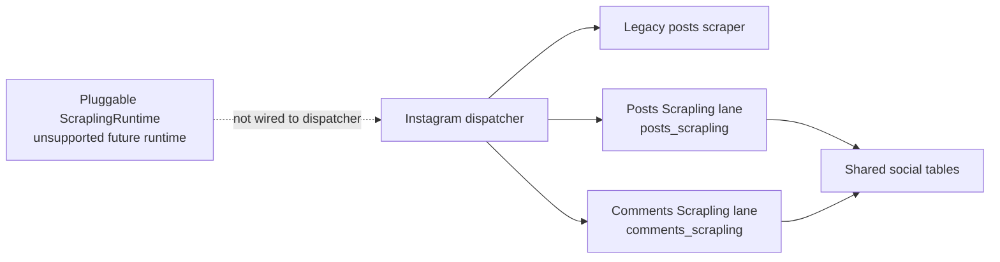

# Instagram Comments Scrapling Lane — Operator Runbook

Last reviewed: 2026-04-22

This document covers the standalone Instagram comments scraper built on
[Scrapling](https://github.com/D4Vinci/Scrapling) v0.4+. It uses the
`instagram_comments_scrapling` lane for the non-Modal path, but queued runs
switch to Modal when the remote executor is enabled. All paths write to the
shared `social.instagram_comments` table. No schema forks, no second scheduler.

---

## Architecture at a glance

### Scrapling lane architecture



The comments Scrapling lane and posts Scrapling lane are concrete worker paths. `ScraplingRuntime` is a future pluggable runtime scaffold and must stay unhealthy/unsupported until a separate implementation verifies the current Scrapling APIs.

```
UI (/social/:platform/:handle/comments)
  └─ POST /api/v1/admin/socials/profiles/:platform/:account_handle/comments/scrape
       └─ start_social_account_comments_scrape(...)
            ├─ queue enabled + Modal remote executor enabled
            │    └─ enqueues job with config.required_execution_backend="modal"
            │         └─ Modal social dispatcher / run_social_comments_job
            └─ local dev inline bypass or Modal not required
                 └─ enqueues job with config.required_worker_lane="instagram_comments_scrapling"
                      └─ comments worker (wrapper over shared scripts/socials/worker.py)
                           └─ InstagramCommentsScraplingFetcher → StealthyFetcher (Patchright)
                                └─ persists into social.instagram_comments (shared table)
```

Key identities:

| Thing                 | Value                                   |
|-----------------------|-----------------------------------------|
| Worker lane           | `instagram_comments_scrapling`          |
| Job stage             | `comments_scrapling`                    |
| Platform filter       | `instagram` (lane does not accept others) |
| Default proxy provider | Decodo/Smartproxy (env-configurable)   |
| Canonical UI URL      | `/social/:platform/:handle/comments`    |

The lane runs a separate OS process from the posts worker. A crash in the
Scrapling / Patchright stack cannot take down the posts pipeline, and a
stale Instagram cookie manifests as a single failed job rather than a
cross-lane outage.

## Glossary

| Term | Meaning |
|---|---|
| Legacy scraper | Existing Instagram scraper path that still owns normal production posts traffic unless a job explicitly opts into a Scrapling stage. |
| Posts Scrapling lane | The opt-in `posts_scrapling` worker path for profile timeline posts. |
| Comments Scrapling lane | The opt-in `comments_scrapling` worker path for post comments. |
| ScraplingRuntime | Future shared runtime abstraction; not the same thing as either production lane today. |
| Warmup | Browser pass that establishes cookies, proxy state, and page/runtime tokens before direct API calls. |
| Cooperative cancellation | Worker checks cancellation between target posts and persistence units; it does not interrupt an in-flight Instagram request. |

---

## Initial setup (local dev)

```bash
cd TRR-Backend
./scripts/setup_scrapling.sh
```

That script does three things, in order:
1. `pip install -r requirements.lock.txt` — pulls in the repo-pinned Scrapling v0.4 package. The current lock targets Scrapling 0.4.9; confirm `.venv/bin/python -m pip show scrapling` and `scrapling --version` report the locked Scrapling version before validation.
2. `scrapling install --force` — downloads or refreshes the Patchright/Playwright browser
   binaries that `StealthyFetcher` needs. Skipping this is the classic
   reason the lane crashes on first run with "browser binary not found".
3. Smoke import — proves `from scrapling.fetchers import StealthyFetcher`
   works in the venv.

`StealthyFetcher.async_fetch` remains signature-compatible on Scrapling
0.4.9 for the comments lane's current call sites.

Idempotent — safe to re-run after pulling upgrades.

---

## Environment variables

Required only for **production** runs; local dev works with cookies alone.

```bash
# Proxy (Decodo default; swap provider by changing _PROVIDER + _URLS)
SOCIAL_INSTAGRAM_COMMENTS_PROXY_PROVIDER=decodo
SOCIAL_INSTAGRAM_COMMENTS_PROXY_URLS=            # explicit URLs bypass Decodo username shaping
SOCIAL_INSTAGRAM_COMMENTS_USE_STICKY_PROXY=true
SOCIAL_INSTAGRAM_COMMENTS_PROXY_SHARD_SESSIONS=true
SOCIAL_INSTAGRAM_COMMENTS_PROXY_SESSION_TTL_SECONDS=600  # seconds; converts/clamps to whole minutes
SOCIAL_INSTAGRAM_COMMENTS_LAUNCH_AUTH_CHECK=false        # worker validation remains enabled

# Run caps: 0 means uncapped.
SOCIAL_INSTAGRAM_COMMENTS_MAX_POSTS_PER_RUN=0
SOCIAL_INSTAGRAM_COMMENTS_MAX_COMMENTS_PER_POST=0
SOCIAL_INSTAGRAM_COMMENT_DELAY_SEC=0.25         # pacing between direct API requests after warmup
SOCIAL_INSTAGRAM_COMMENT_PAGINATION_MAX_PAGES=0
SOCIAL_INSTAGRAM_COMMENT_PAGINATION_MAX_SECONDS=180
SOCIAL_INSTAGRAM_REPLY_PAGINATION_MAX_PAGES=0
SOCIAL_INSTAGRAM_REPLY_PAGINATION_MAX_SECONDS=120
SOCIAL_INSTAGRAM_COMMENTS_SINGLE_SESSION_LOAD_ALL_ENABLED=false
SOCIAL_INSTAGRAM_COMMENTS_SINGLE_SESSION_RENDERED_CLICK_LIMIT=10
SOCIAL_INSTAGRAM_COMMENTS_SINGLE_SESSION_RENDERED_SCROLL_LIMIT=12
SOCIAL_INSTAGRAM_COMMENTS_SINGLE_SESSION_RENDERED_STALL_LIMIT=3
SOCIAL_INSTAGRAM_COMMENTS_SINGLE_SESSION_RENDERED_DEADLINE_SECONDS=45
SOCIAL_INSTAGRAM_COMMENTS_SINGLE_SESSION_MAX_IN_MEMORY_ROWS=5000

# Browser mode (false for visual debugging)
SOCIAL_INSTAGRAM_COMMENTS_HEADLESS=true

# Decodo-specific (when PROVIDER=decodo and no explicit _URLS)
DECODO_USERNAME=...
DECODO_PASSWORD=...
DECODO_GATEWAY=gate.decodo.com:7000

# Worker lane scaling
TRR_SOCIAL_INGEST_WORKER_ENABLED=1
TRR_SOCIAL_INGEST_WORKER_COMMENTS_SCRAPLING=1    # default 0 — opt in explicitly
```

Proxy behavior:
- `SOCIAL_INSTAGRAM_COMMENTS_USE_STICKY_PROXY=true` only affects the Decodo username:password path.
- When enabled, the proxy builder appends `session-<id>-sessionduration-<minutes>` parameters to the username so browser warmup and `httpx` share one sticky upstream.
- `SOCIAL_INSTAGRAM_COMMENTS_PROXY_SESSION_TTL_SECONDS` is converted to whole minutes and clamped to Decodo's supported `1..1440` minute range.
- `SOCIAL_INSTAGRAM_COMMENTS_PROXY_URLS` keeps highest precedence and bypasses all Decodo username shaping.
- Sticky-session support in this change is intentionally comments-lane-only; posts-lane parity is a separate decision.
- `SOCIAL_INSTAGRAM_COMMENTS_SINGLE_SESSION_LOAD_ALL_ENABLED=true` enables the opt-in `single_session_load_all` request strategy. It preserves API cursor pagination internally, falls back to bounded rendered post hydration only when needed, and forces profile comments runs to one shard by default.
- The `SOCIAL_INSTAGRAM_COMMENTS_SINGLE_SESSION_RENDERED_*` and `SOCIAL_INSTAGRAM_COMMENTS_SINGLE_SESSION_MAX_IN_MEMORY_ROWS` values bound rendered hydration so a large post stops as retryable/incomplete instead of running unbounded.

---

## Starting workers

### Local dev

```bash
# Single-worker, manually
SOCIAL_WORKER_LANE=instagram_comments_scrapling \
  python -m scripts.socials.instagram.comments_worker --parallel 1 --interval 3

# Multi-worker via launcher (matches production shape)
TRR_SOCIAL_INGEST_WORKER_ENABLED=1 \
TRR_SOCIAL_INGEST_WORKER_COMMENTS_SCRAPLING=1 \
  ./scripts/start_remote_job_workers.sh
```

Restart note: stale worker processes may keep old retry or cancellation behavior until restarted. Before validating cancellation, warmup, or transport retry changes, stop the old worker process and start it again with one of the commands above.

### Production (Modal)

Current Modal defaults come from `trr_backend/modal_jobs.py`, including
`TRR_REMOTE_EXECUTOR=modal` and `TRR_MODAL_ENABLED=1`. The social browser
image already installs Scrapling + browser binaries (see the
`_SOCIAL_BROWSER_SETUP_COMMANDS` constant which includes both
`playwright install chromium` and `scrapling install --force`). Deploy via the
standard Modal pipeline; no dedicated comments worker lane is required in
this path because the queued job is dispatched against the Modal executor.
The comments-specific env vars above still need to be present in the Modal
runtime so warmup, proxy shaping, and fetch caps match local behavior.

---

## One-shot debugging

When the lane misbehaves in production, reproduce locally in non-headless
mode to watch the browser:

```bash
SOCIAL_INSTAGRAM_COMMENTS_HEADLESS=false \
  python -m scripts.socials.instagram.comments_scrape_cli \
    --shortcode=<SHORTCODE> \
    --max-comments=20
```

This bypasses the queue and runs the fetch inline so you can see the
Patchright window, the cookie state, and the requests being made.

### Manual-only one-page smoke

Run only with operator approval because it creates live scrape rows and reaches Instagram. Use a single shortcode with known comments:

```bash
SOCIAL_INSTAGRAM_COMMENTS_HEADLESS=true \
  .venv/bin/python -m scripts.socials.instagram.comments_scrape_cli \
    --shortcode=<SHORTCODE> \
    --max-comments=25
```

---

## Known failure modes and remediation

### 1. `SOCIAL_WORKER_UNAVAILABLE` or `SOCIAL_MODAL_EXECUTOR_REQUIRED`

**Symptom.** Comments tab shows either local worker-lane unavailability or
Modal-executor-required copy, depending on the queue/runtime mode.

**Cause.**
- `SOCIAL_WORKER_UNAVAILABLE`: the non-Modal `instagram_comments_scrapling`
  lane is required and nothing is heartbeating it.
- `SOCIAL_MODAL_EXECUTOR_REQUIRED`: queue mode is routing the job to Modal,
  but the Modal executor/runtime is not available.

**Fix.**
For local dev or any non-Modal lane path, start the worker:
```bash
TRR_SOCIAL_INGEST_WORKER_ENABLED=1 \
TRR_SOCIAL_INGEST_WORKER_COMMENTS_SCRAPLING=1 \
  ./scripts/start_remote_job_workers.sh
```
For Modal-backed production, verify `TRR_REMOTE_EXECUTOR=modal`,
`TRR_MODAL_ENABLED=1`, and the current Modal deployment/runtime health.
Never work around either enforcement path by dropping the runtime checks —
they are what prevent jobs from being routed into an executor that cannot
actually run the comments scraper.

### 2. `instagram_comments_auth_failed`

**Symptom.** Job fails with "Instagram auth failed while fetching comments..."

**Cause.** Cookies expired or IG pushed a login checkpoint.

**Fix.** Refresh cookies via `scripts/socials/cookie_refresh_worker.py`
(same refresh flow the posts pipeline uses). Once a fresh `sessionid` is
saved, the next queued job auto-uses it.

### 3. Browser binary not found at worker startup

**Symptom.** Worker logs include something like
`Executable doesn't exist at /root/.cache/ms-playwright/chromium-*`.

**Cause.** `scrapling install --force` / `playwright install chromium` wasn't run
in the image.

**Fix.** For local: rerun `./scripts/setup_scrapling.sh`. For Modal:
confirm `_SOCIAL_BROWSER_SETUP_COMMANDS` in `trr_backend/modal_jobs.py`
still contains `"scrapling install --force"`, and redeploy the browser image.

### 4. IG rotates the GraphQL `doc_id` / HTML structure

**Symptom.** Jobs start returning empty `comments=[]` for posts you know
have comments; `fetch_reason` is `api_status_fail` or `non_json_response`.

**Cause.** Instagram periodically rotates its private GraphQL `doc_id`
params (roughly every 2–4 weeks) or changes the shape of the JSON response
around `has_more_comments` / `next_min_id`.

**Fix.**
1. Reproduce via the one-shot CLI in non-headless mode (§ One-shot debugging).
2. Open the DevTools network tab in the Patchright window and capture the
   actual request Instagram makes to `/api/v1/media/:id/comments/`. Update
   `trr_backend/socials/instagram/constants.py::COMMENTS_URL` and any
   `params` in `fetcher.py::fetch_comments_for_shortcode`.
3. Update the fixture the parser tests load from
   `tests/fixtures/instagram/comments/` and rerun pytest.
4. Bump the relevant Scrapling version pin if the response shape change
   coincides with a Scrapling release; run the P1-4 contract test first.

### 5. Proxy bandwidth exhausted mid-run

**Symptom.** 407 / auth-fail responses from the proxy after a burst of
successful fetches.

**Cause.** Decodo (or whichever provider) balance ran out.

**Fix.** Top up the proxy account, OR add a new provider URL via
`SOCIAL_INSTAGRAM_COMMENTS_PROXY_URLS=...` (highest precedence, overrides
provider-specific builder). The fetcher's retry/backoff (P1-5) will
re-attempt transient failures up to three times with exponential backoff
before surfacing `retryable=true` so the queue requeues.

### 6. Transient 429 or 5xx from Instagram

**Symptom.** Job metadata shows `error_code=http_429` or `http_5xx` but
job status is `retrying` (not `failed`).

**Cause.** Expected. The fetcher retries up to 3 times with exponential
backoff, honoring `Retry-After`. After that the job is marked retryable
and the queue requeues on its own.

**Fix.** No action unless retries persistently fail — in that case the
proxy pool is likely flagged; swap to a fresh IP set.

### 7. Retryable transport failure

**Symptom.** Job metadata shows `transport_error` or `transport_timeout`
with `retryable=true`.

**Cause.** Network, proxy, DNS, socket, or timeout failure after bounded
fetcher retries. This is not a parser failure.

**Fix.** Check proxy health and network path, then allow queue retry if
the upstream has recovered.

### 8. Cooperative cancellation delay

**Symptom.** A cancelled job does not stop until the current post or DB
unit finishes.

**Cause.** Expected. Cooperative cancellation is checked between target
posts and persistence units so the worker can leave consistent metadata
and avoid interrupting active Instagram requests.

**Fix.** Wait for the current unit to finish. If local behavior does not
match the current code, restart stale worker processes before retesting.

---

## Implementation note: "separate daemon" vs shared `worker.py`

The plan called for a "separate daemon". The implementation satisfies
that requirement via **a separate OS process** running the thin wrapper
at `scripts/socials/instagram/comments_worker.py`, which imports and
invokes `scripts.socials.worker.main()` with a prepended
`--stage comments_scrapling --platform instagram` and
`SOCIAL_WORKER_LANE=instagram_comments_scrapling`. Process isolation is
preserved (a Scrapling crash cannot take down the posts worker). Code
sharing via the shared worker module means the lane inherits heartbeat,
claim-loop, and recovery behavior for free — exactly what's desired.

---

## Tests to run before shipping changes to this lane

```bash
cd TRR-Backend
.venv/bin/ruff check trr_backend/socials/instagram/comments_scrapling \
  scripts/socials/instagram/ api/routers/socials.py
.venv/bin/ruff format --check trr_backend/socials/instagram/comments_scrapling \
  scripts/socials/instagram/
.venv/bin/pytest -q \
  tests/socials/test_instagram_comments_scrapling*.py \
  tests/scripts/test_instagram_comments_worker.py

cd ../TRR-APP
pnpm -C apps/web run lint
pnpm -C apps/web exec next build --webpack
pnpm -C apps/web exec vitest run social-account-profile-page.runtime show-admin-routes
```

All three sections must pass before merge.

---

## Out of scope for this lane

- instagrapi / private mobile API fallback.
- Replacing the existing `requests` + GraphQL posts scraper.
- Broad migration of other admin URL tabs from `/admin/social/` to
  `/social/` (only the comments tab was migrated; see the Locked
  Decisions in the fix plan).
- Second scheduler / second queue table.
