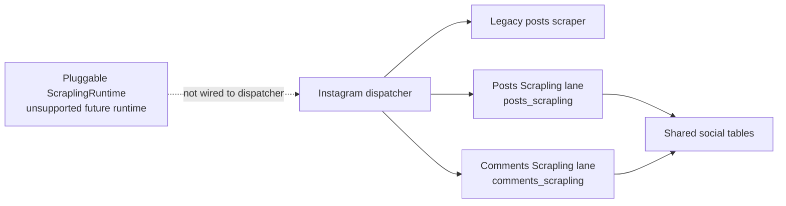

# Instagram Posts Scrapling Runbook

**Status:** Active Backfill Posts post-discovery lane. Last reviewed: 2026-06-08.

For shared Scrapling process rules, optional browser tuning envs, and
redaction-safe metadata expectations across social lanes, see
[Scrapling Social Jobs](/Users/thomashulihan/Projects/TRR/TRR-Backend/docs/workspace/scrapling-social-jobs.md).

## What this lane does

- Uses Scrapling/Patchright to warm up an Instagram profile page (`https://www.instagram.com/{username}/`), solving challenges and extracting runtime tokens (`lsd`, `bloks_version`, `__spin_*`).
- Bridges the browser cookies into an `httpx.AsyncClient` and calls `https://www.instagram.com/graphql/query` with the profile timeline `doc_id`, paginating via `after` + `end_cursor`.
- Handles both the legacy `Graph*` response shape and the newer `XDTMediaDict` shape returned by the current profile timeline connection.
- Persists each raw GraphQL edge node through the canonical `_upsert_instagram_post()` repo helper, preserving view monotonicity, optional columns, and mirror metadata.
- Does not use Apify, managed scraper actors, the Meta API, or `apify-client`.

## Scrapling lane architecture



The posts Scrapling lane and comments Scrapling lane are concrete worker paths. `ScraplingRuntime` is a future pluggable runtime scaffold and must stay unhealthy/unsupported until a separate implementation verifies the current Scrapling APIs.

## Glossary

| Term | Meaning |
|---|---|
| Legacy scraper | Existing compatibility path for non-stage-specific Instagram scraping. Backfill Posts post discovery should use the posts Scrapling lane. |
| Posts Scrapling lane | The opt-in `posts_scrapling` worker path for profile timeline posts. |
| Comments Scrapling lane | The opt-in `comments_scrapling` worker path for post comments. |
| ScraplingRuntime | Future shared runtime abstraction; not the same thing as either production lane today. |
| Warmup | Browser pass that establishes cookies, proxy state, and page/runtime tokens before direct API calls. |
| Cooperative cancellation | Worker checks cancellation between units of work and stops cleanly; it does not interrupt an in-flight Instagram request. |

## Routing

- `job_type = "posts"` (already in `scrape_jobs` check constraint)
- `config.stage = INSTAGRAM_POSTS_SCRAPLING_STAGE` ("posts_scrapling")
- `config.required_worker_lane = INSTAGRAM_POSTS_SCRAPLING_WORKER_LANE` ("instagram_posts_scrapling") when using queue-safe enqueue
- Dispatch branch: `social_season_analytics.py:_execute_claimed_job` routes platform=instagram + stage=posts_scrapling → `run_instagram_posts_scrapling_job`

## Required env vars

| Var | Purpose | Notes |
|---|---|---|
| `SOCIAL_INSTAGRAM_COOKIES_JSON` or `SOCIAL_INSTAGRAM_COOKIES_FILE` | Session cookies | `auth_resolver` accepts either |
| `DECODO_USERNAME` / `DECODO_PASSWORD` / `DECODO_GATEWAY` | Proxy creds | Optional; only used when `SOCIAL_INSTAGRAM_POSTS_PROXY_PROVIDER=decodo` |
| `SOCIAL_INSTAGRAM_POSTS_PROXY_URLS` | Explicit proxy list | Takes precedence over DECODO |
| `SOCIAL_INSTAGRAM_POSTS_PROXY_PROVIDER` | Override provider | Default: `none`; set `decodo` explicitly to use Decodo |
| `SOCIAL_INSTAGRAM_POSTS_USE_STICKY_PROXY` | Pin one Decodo session across warmup + GraphQL | Default: `false` |
| `SOCIAL_INSTAGRAM_POSTS_PROXY_SESSION_TTL_SECONDS` | Sticky-session lifetime for generated Decodo usernames | Default: `600` |
| `SOCIAL_INSTAGRAM_POSTS_HEADLESS` | Browser headless toggle | Default: `true` |
| `SOCIAL_INSTAGRAM_DELAY_SEC` | Delay between direct GraphQL requests after warmup | Default: `0.15` |
| `TRR_DB_URL` | Postgres URL | Required. `TRR_DB_FALLBACK_URL` remains an optional explicit fallback only. |

Scrapling version check: `scripts/setup_scrapling.sh` installs the repo-pinned package from `requirements.lock.txt` and refreshes browser assets with `scrapling install --force`. The current lock targets Scrapling 0.4.9. Before local validation, confirm `.venv/bin/python -m pip show scrapling` and `scrapling --version` report the current locked Scrapling version.
`StealthyFetcher.async_fetch` remains signature-compatible on Scrapling 0.4.9 for this lane's current call sites.

## Invocation

### Manual smoke (creates real run+job rows)

```bash
python scripts/socials/instagram/smoke_posts_scrapling.py --account bravotv --max-pages 1 --fast
```

### Manual-only one-page smoke

Run only with operator approval because it creates live scrape rows and reaches Instagram:

```bash
.venv/bin/python scripts/socials/instagram/smoke_posts_scrapling.py \
  --account bravotv \
  --max-pages 1 \
  --fast
```

### Queue-safe enqueue

```python
from trr_backend.repositories.social_season_analytics import start_instagram_posts_scrapling_scrape

result = start_instagram_posts_scrapling_scrape(
    account_handle="bravotv",
    max_pages=5,
    fast_mode=True,
    initiated_by="operator@example.com",
)
# result = {"run_id": ..., "job_id": ..., "status": "queued",
#           "platform": "instagram", "account_handle": "bravotv",
#           "required_worker_lane": "instagram_posts_scrapling"}
```

The helper acquires a per-account advisory lock so only one posts_scrapling run can be active per account at a time. When `is_queue_enabled()` is True, it also asserts a worker with the `instagram_posts_scrapling` lane is available before enqueuing — preventing dead-letter jobs.

## Failure modes and recovery

| Symptom | Likely cause | Action |
|---|---|---|
| `instagram_posts_auth_failed` in scrape_jobs.error_message | Cookies invalid/expired or challenge required | Resolve checkpoints manually first, then run the staged Manual Instagram Auth validation/sync flow from `docs/runbooks/social_worker_queue_ops.md` |
| `instagram_posts_warmup_no_cookies` | Warmup returned no cookies and no prior `sessionid` was available | Validate Chrome auth first, sync local cookies only after confirmation, verify browser storage state, then rerun after the worker has restarted |
| `http_429` with `retryable: true` | Rate limiting | Decrease concurrency; wait for backoff retry |
| `transport_error` or `transport_timeout` with `retryable: true` | Proxy, DNS, socket, or timeout failure after bounded retries | Check proxy health and network path; queue retry can proceed if the upstream recovers |
| `html_challenge_or_auth_required` | Session triggered Instagram challenge | Stop retries, clear the challenge manually, then run the staged Manual Instagram Auth validation flow before any cookie sync or Modal action |
| `graphql_empty_connection` on all doc_ids | Instagram rotated doc_ids | Update `PROFILE_POSTS_DOC_IDS` in `constants.py` — check a fresh profile page manually |
| No posts upserted but `items_found > 0` | Response shape changed again | Inspect `raw_node` — check if fields match XDTMediaDict or a newer shape; add a new branch to `_graph_node_to_post_dto` |
| `SOCIAL_POSTS_SCRAPLING_RUN_ALREADY_ACTIVE` from `start_instagram_posts_scrapling_scrape` | Another run is already queued/running for this account | Wait for the existing run to complete, or cancel it |
| `SocialWorkerUnavailableError` from `start_*` | Queue is enabled but no worker is heartbeating with the `instagram_posts_scrapling` lane | Start a worker with `--worker-lane instagram_posts_scrapling` or disable queue mode |

## Warmup, retry, and cancellation guidance

- Warmup failures preserve the latest runtime metadata on the failed job. `instagram_posts_warmup_no_cookies` specifically means neither warmup nor the existing auth session provided a usable `sessionid`.
- Retryable transport failures use stable reason codes: `transport_error` for broad `httpx.TransportError` failures and `transport_timeout` for timeout classes. These are network/proxy symptoms, not parser failures.
- Cooperative cancellation is observed between pages and persistence units. A cancellation request may wait for the current Instagram request or DB write to finish before the job moves to `cancelled`.
- A stale worker process may keep old cancellation/retry behavior until restarted. For local validation, stop old social worker processes and restart through the workspace worker launcher or the lane-specific command documented in the workspace dev commands runbook.

## Observability

- Structured logs under logger `socials.instagram.posts_scrapling.fetcher` with `extra.event` field. Currently emitted:
  - `warmup_success` — fires after browser warmup completes (browser nav → cookie merge → httpx client rebuild). Includes `account`, `cookie_count`, `page_tokens_count`, `proxy_fingerprint`. Tail with `grep '"event": "warmup_success"' /var/log/...`.
- Job metadata (`scrape_jobs.metadata`):
  - `stage_counters.posts` — raw posts fetched from API
  - `persist_counters.posts_upserted` — posts successfully upserted (difference indicates silent drops)
  - `fetcher_runtime.warmup_cookie_count` — number of new cookies from warmup (cookie *names* available via `warmup_cookie_names` — values are scrubbed for security)
  - `fetcher_runtime.selected_proxy_fingerprint` — safe proxy identity (host:port:provider, no credentials)
  - `fetcher_runtime.page_tokens_found` — which runtime tokens extracted (empty list means regex didn't match — IG doesn't always require them)
- `social.instagram_posts.metadata_source = "posts_scrapling"` marks rows from this lane for shadow comparison queries.

## Known limitations

- No identity pool — DECODO handles rotation at provider level. If a specific IP gets blocked, rotate DECODO session ID.
- Backfill Posts uses the shared-account catalog pipeline and posts Scrapling lane for post discovery; do not add managed scraper actors as a shortcut.
- Shadow comparison framework not built — compare ad-hoc via SQL:
  ```sql
  SELECT shortcode, username, likes, comments_count, views, metadata_source, scraped_at
  FROM social.instagram_posts
  WHERE username = 'bravotv'
    AND scraped_at > now() - interval '1 day'
  ORDER BY scraped_at DESC LIMIT 20;
  ```
- Orphaned-run risk: if `_create_job` fails after `_create_run` succeeds (e.g., schema validation error), the resulting orphaned `scrape_runs` row in status `queued` blocks future enqueues for this account until manually cleared. This pattern is inherited from the comments lane and tracked for Phase E cleanup.
