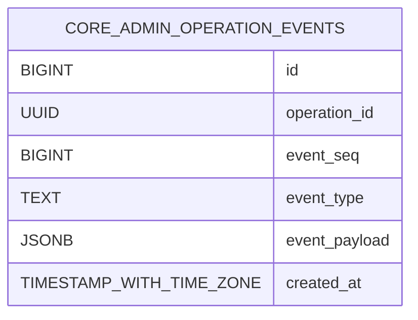

# core.admin_operation_events - Table Structure Diagram

Auto-generated schema diagram showing columns and data types.

```mermaid
erDiagram
    CORE_ADMIN_OPERATION_EVENTS {
        BIGINT id
        UUID operation_id
        BIGINT event_seq
        TEXT event_type
        JSONB event_payload
        TIMESTAMP_WITH_TIME_ZONE created_at
    }
```
