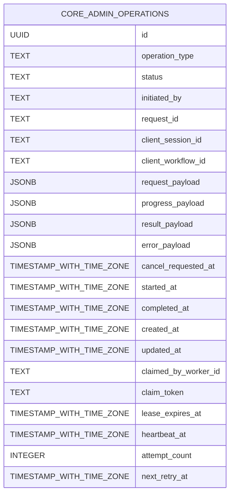

# core.admin_operations - Table Structure Diagram

Auto-generated schema diagram showing columns and data types.

```mermaid
erDiagram
    CORE_ADMIN_OPERATIONS {
        UUID id
        TEXT operation_type
        TEXT status
        TEXT initiated_by
        TEXT request_id
        TEXT client_session_id
        TEXT client_workflow_id
        JSONB request_payload
        JSONB progress_payload
        JSONB result_payload
        JSONB error_payload
        TIMESTAMP_WITH_TIME_ZONE cancel_requested_at
        TIMESTAMP_WITH_TIME_ZONE started_at
        TIMESTAMP_WITH_TIME_ZONE completed_at
        TIMESTAMP_WITH_TIME_ZONE created_at
        TIMESTAMP_WITH_TIME_ZONE updated_at
        TEXT claimed_by_worker_id
        TEXT claim_token
        TIMESTAMP_WITH_TIME_ZONE lease_expires_at
        TIMESTAMP_WITH_TIME_ZONE heartbeat_at
        INTEGER attempt_count
        TIMESTAMP_WITH_TIME_ZONE next_retry_at
    }
```
