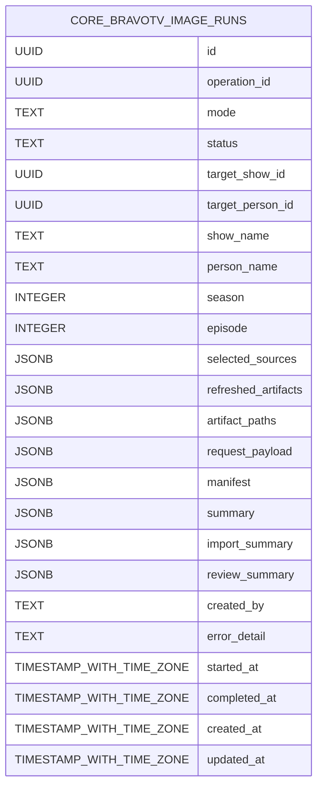

# core.bravotv_image_runs - Table Structure Diagram

Auto-generated schema diagram showing columns and data types.

```mermaid
erDiagram
    CORE_BRAVOTV_IMAGE_RUNS {
        UUID id
        UUID operation_id
        TEXT mode
        TEXT status
        UUID target_show_id
        UUID target_person_id
        TEXT show_name
        TEXT person_name
        INTEGER season
        INTEGER episode
        JSONB selected_sources
        JSONB refreshed_artifacts
        JSONB artifact_paths
        JSONB request_payload
        JSONB manifest
        JSONB summary
        JSONB import_summary
        JSONB review_summary
        TEXT created_by
        TEXT error_detail
        TIMESTAMP_WITH_TIME_ZONE started_at
        TIMESTAMP_WITH_TIME_ZONE completed_at
        TIMESTAMP_WITH_TIME_ZONE created_at
        TIMESTAMP_WITH_TIME_ZONE updated_at
    }
```
