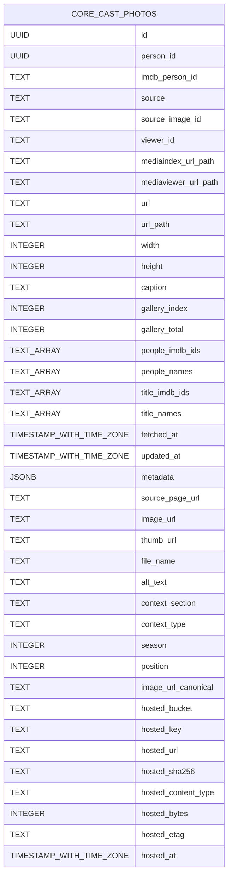

# core.cast_photos - Table Structure Diagram

Auto-generated schema diagram showing columns and data types.

```mermaid
erDiagram
    CORE_CAST_PHOTOS {
        UUID id
        UUID person_id
        TEXT imdb_person_id
        TEXT source
        TEXT source_image_id
        TEXT viewer_id
        TEXT mediaindex_url_path
        TEXT mediaviewer_url_path
        TEXT url
        TEXT url_path
        INTEGER width
        INTEGER height
        TEXT caption
        INTEGER gallery_index
        INTEGER gallery_total
        TEXT_ARRAY people_imdb_ids
        TEXT_ARRAY people_names
        TEXT_ARRAY title_imdb_ids
        TEXT_ARRAY title_names
        TIMESTAMP_WITH_TIME_ZONE fetched_at
        TIMESTAMP_WITH_TIME_ZONE updated_at
        JSONB metadata
        TEXT source_page_url
        TEXT image_url
        TEXT thumb_url
        TEXT file_name
        TEXT alt_text
        TEXT context_section
        TEXT context_type
        INTEGER season
        INTEGER position
        TEXT image_url_canonical
        TEXT hosted_bucket
        TEXT hosted_key
        TEXT hosted_url
        TEXT hosted_sha256
        TEXT hosted_content_type
        INTEGER hosted_bytes
        TEXT hosted_etag
        TIMESTAMP_WITH_TIME_ZONE hosted_at
    }
```
