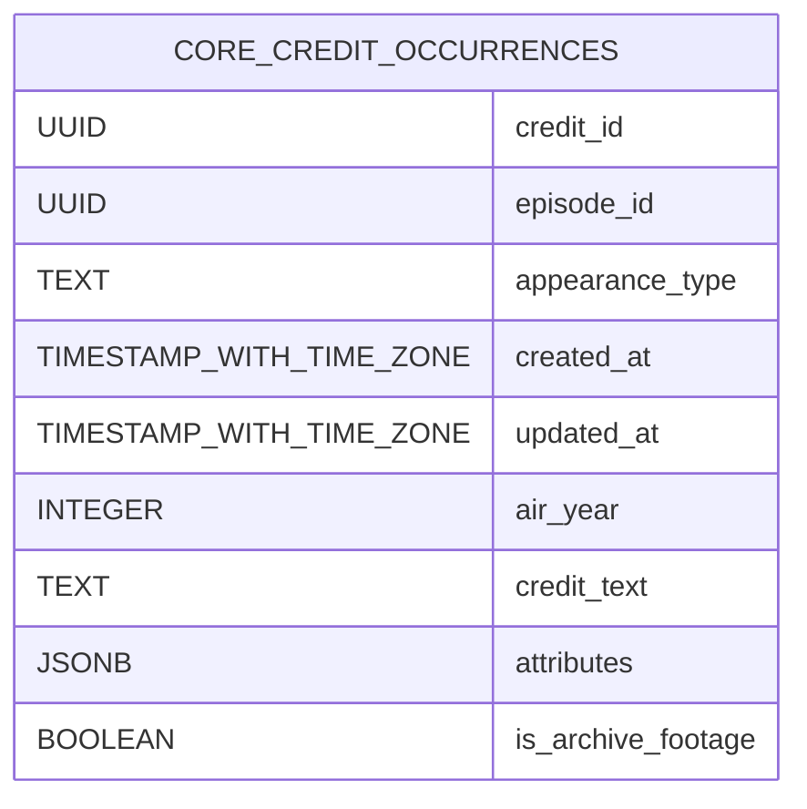

# core.credit_occurrences - Table Structure Diagram

Auto-generated schema diagram showing columns and data types.

```mermaid
erDiagram
    CORE_CREDIT_OCCURRENCES {
        UUID credit_id
        UUID episode_id
        TEXT appearance_type
        TIMESTAMP_WITH_TIME_ZONE created_at
        TIMESTAMP_WITH_TIME_ZONE updated_at
        INTEGER air_year
        TEXT credit_text
        JSONB attributes
        BOOLEAN is_archive_footage
    }
```
