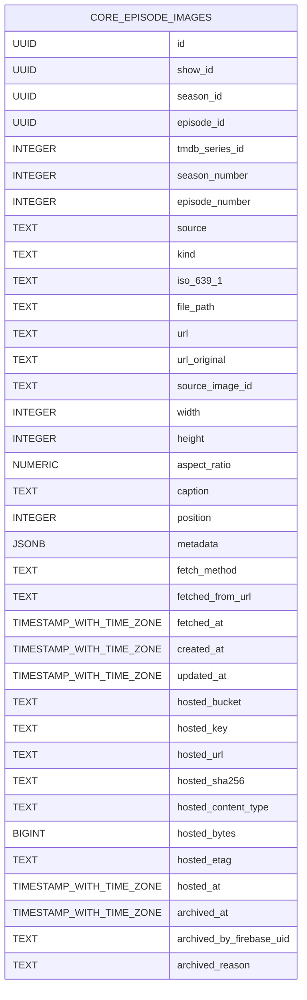

# core.episode_images - Table Structure Diagram

Auto-generated schema diagram showing columns and data types.

```mermaid
erDiagram
    CORE_EPISODE_IMAGES {
        UUID id
        UUID show_id
        UUID season_id
        UUID episode_id
        INTEGER tmdb_series_id
        INTEGER season_number
        INTEGER episode_number
        TEXT source
        TEXT kind
        TEXT iso_639_1
        TEXT file_path
        TEXT url
        TEXT url_original
        TEXT source_image_id
        INTEGER width
        INTEGER height
        NUMERIC aspect_ratio
        TEXT caption
        INTEGER position
        JSONB metadata
        TEXT fetch_method
        TEXT fetched_from_url
        TIMESTAMP_WITH_TIME_ZONE fetched_at
        TIMESTAMP_WITH_TIME_ZONE created_at
        TIMESTAMP_WITH_TIME_ZONE updated_at
        TEXT hosted_bucket
        TEXT hosted_key
        TEXT hosted_url
        TEXT hosted_sha256
        TEXT hosted_content_type
        BIGINT hosted_bytes
        TEXT hosted_etag
        TIMESTAMP_WITH_TIME_ZONE hosted_at
        TIMESTAMP_WITH_TIME_ZONE archived_at
        TEXT archived_by_firebase_uid
        TEXT archived_reason
    }
```
