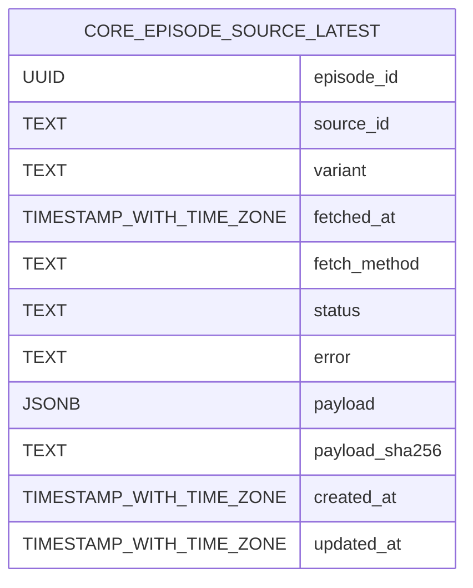

# core.episode_source_latest - Table Structure Diagram

Auto-generated schema diagram showing columns and data types.

```mermaid
erDiagram
    CORE_EPISODE_SOURCE_LATEST {
        UUID episode_id
        TEXT source_id
        TEXT variant
        TIMESTAMP_WITH_TIME_ZONE fetched_at
        TEXT fetch_method
        TEXT status
        TEXT error
        JSONB payload
        TEXT payload_sha256
        TIMESTAMP_WITH_TIME_ZONE created_at
        TIMESTAMP_WITH_TIME_ZONE updated_at
    }
```
