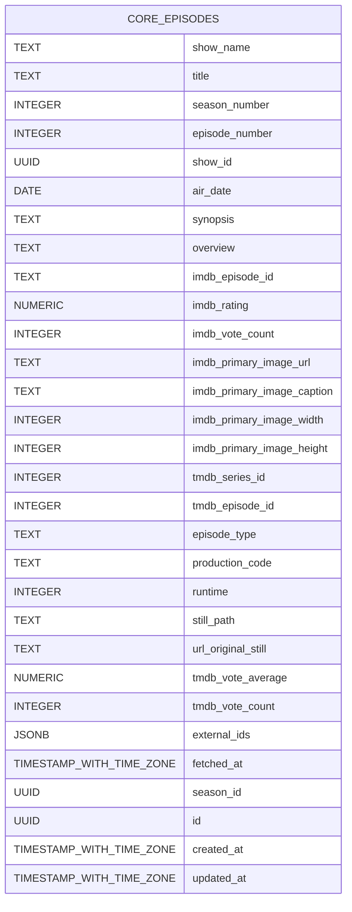

# core.episodes - Table Structure Diagram

Auto-generated schema diagram showing columns and data types.

```mermaid
erDiagram
    CORE_EPISODES {
        TEXT show_name
        TEXT title
        INTEGER season_number
        INTEGER episode_number
        UUID show_id
        DATE air_date
        TEXT synopsis
        TEXT overview
        TEXT imdb_episode_id
        NUMERIC imdb_rating
        INTEGER imdb_vote_count
        TEXT imdb_primary_image_url
        TEXT imdb_primary_image_caption
        INTEGER imdb_primary_image_width
        INTEGER imdb_primary_image_height
        INTEGER tmdb_series_id
        INTEGER tmdb_episode_id
        TEXT episode_type
        TEXT production_code
        INTEGER runtime
        TEXT still_path
        TEXT url_original_still
        NUMERIC tmdb_vote_average
        INTEGER tmdb_vote_count
        JSONB external_ids
        TIMESTAMP_WITH_TIME_ZONE fetched_at
        UUID season_id
        UUID id
        TIMESTAMP_WITH_TIME_ZONE created_at
        TIMESTAMP_WITH_TIME_ZONE updated_at
    }
```
