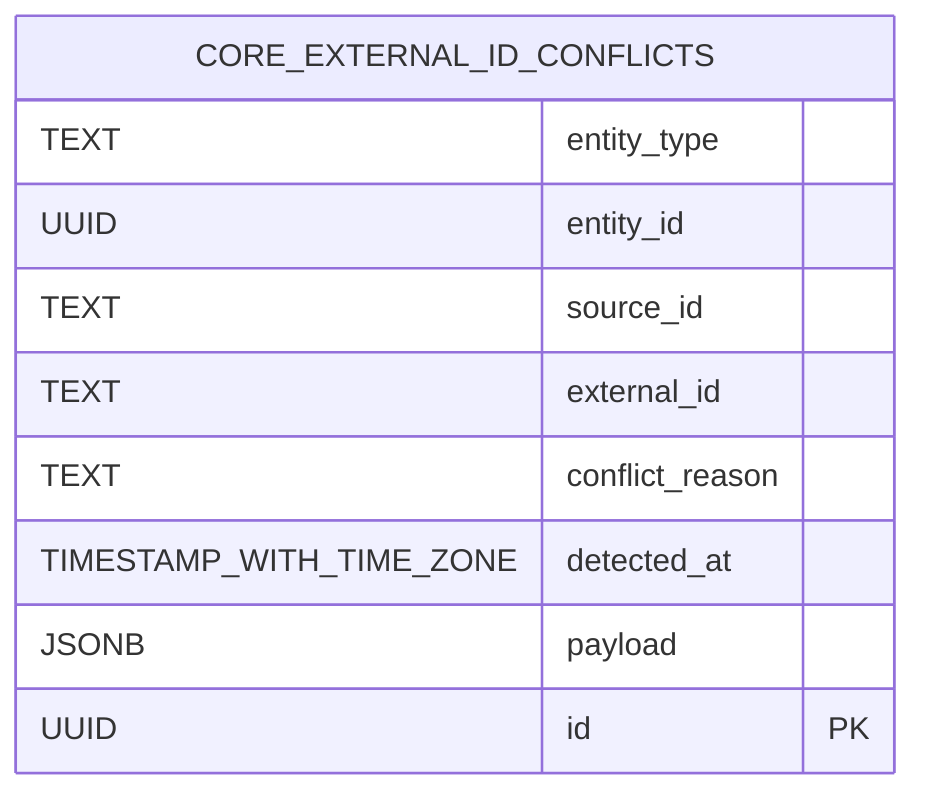

# core.external_id_conflicts - Table Structure Diagram

Auto-generated schema diagram showing columns and data types.

```mermaid
erDiagram
    CORE_EXTERNAL_ID_CONFLICTS {
        TEXT entity_type
        UUID entity_id
        TEXT source_id
        TEXT external_id
        TEXT conflict_reason
        TIMESTAMP_WITH_TIME_ZONE detected_at
        JSONB payload
        UUID id PK
    }
```
