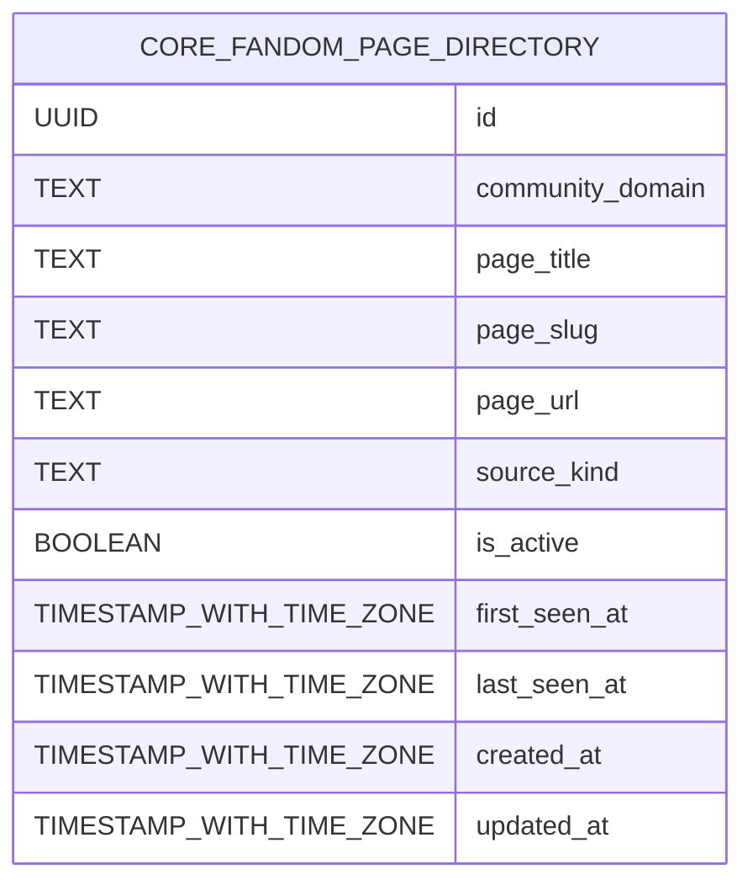

# core.fandom_page_directory - Table Structure Diagram

Auto-generated schema diagram showing columns and data types.

```mermaid
erDiagram
    CORE_FANDOM_PAGE_DIRECTORY {
        UUID id
        TEXT community_domain
        TEXT page_title
        TEXT page_slug
        TEXT page_url
        TEXT source_kind
        BOOLEAN is_active
        TIMESTAMP_WITH_TIME_ZONE first_seen_at
        TIMESTAMP_WITH_TIME_ZONE last_seen_at
        TIMESTAMP_WITH_TIME_ZONE created_at
        TIMESTAMP_WITH_TIME_ZONE updated_at
    }
```
