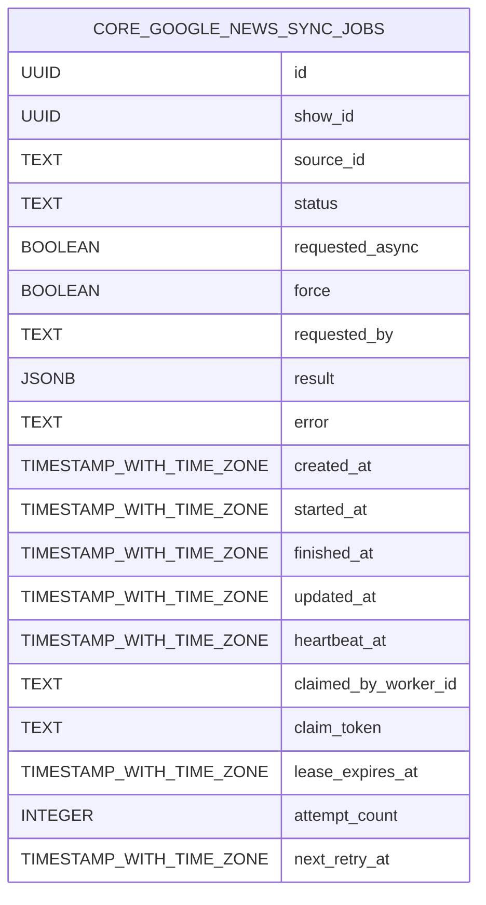

# core.google_news_sync_jobs - Table Structure Diagram

Auto-generated schema diagram showing columns and data types.

```mermaid
erDiagram
    CORE_GOOGLE_NEWS_SYNC_JOBS {
        UUID id
        UUID show_id
        TEXT source_id
        TEXT status
        BOOLEAN requested_async
        BOOLEAN force
        TEXT requested_by
        JSONB result
        TEXT error
        TIMESTAMP_WITH_TIME_ZONE created_at
        TIMESTAMP_WITH_TIME_ZONE started_at
        TIMESTAMP_WITH_TIME_ZONE finished_at
        TIMESTAMP_WITH_TIME_ZONE updated_at
        TIMESTAMP_WITH_TIME_ZONE heartbeat_at
        TEXT claimed_by_worker_id
        TEXT claim_token
        TIMESTAMP_WITH_TIME_ZONE lease_expires_at
        INTEGER attempt_count
        TIMESTAMP_WITH_TIME_ZONE next_retry_at
    }
```
