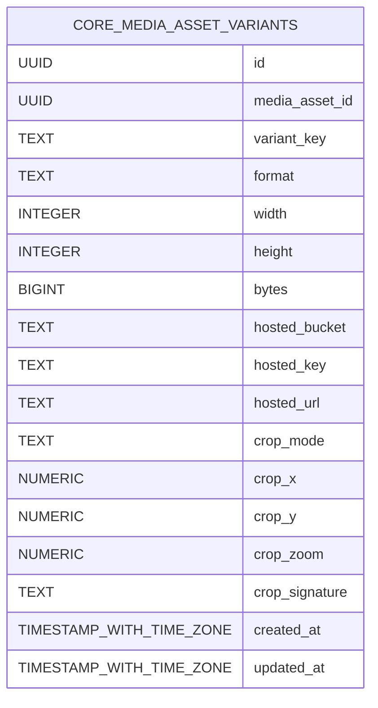

# core.media_asset_variants - Table Structure Diagram

Auto-generated schema diagram showing columns and data types.

```mermaid
erDiagram
    CORE_MEDIA_ASSET_VARIANTS {
        UUID id
        UUID media_asset_id
        TEXT variant_key
        TEXT format
        INTEGER width
        INTEGER height
        BIGINT bytes
        TEXT hosted_bucket
        TEXT hosted_key
        TEXT hosted_url
        TEXT crop_mode
        NUMERIC crop_x
        NUMERIC crop_y
        NUMERIC crop_zoom
        TEXT crop_signature
        TIMESTAMP_WITH_TIME_ZONE created_at
        TIMESTAMP_WITH_TIME_ZONE updated_at
    }
```
