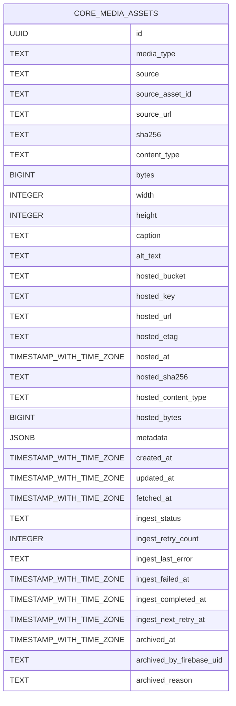

# core.media_assets - Table Structure Diagram

Auto-generated schema diagram showing columns and data types.

```mermaid
erDiagram
    CORE_MEDIA_ASSETS {
        UUID id
        TEXT media_type
        TEXT source
        TEXT source_asset_id
        TEXT source_url
        TEXT sha256
        TEXT content_type
        BIGINT bytes
        INTEGER width
        INTEGER height
        TEXT caption
        TEXT alt_text
        TEXT hosted_bucket
        TEXT hosted_key
        TEXT hosted_url
        TEXT hosted_etag
        TIMESTAMP_WITH_TIME_ZONE hosted_at
        TEXT hosted_sha256
        TEXT hosted_content_type
        BIGINT hosted_bytes
        JSONB metadata
        TIMESTAMP_WITH_TIME_ZONE created_at
        TIMESTAMP_WITH_TIME_ZONE updated_at
        TIMESTAMP_WITH_TIME_ZONE fetched_at
        TEXT ingest_status
        INTEGER ingest_retry_count
        TEXT ingest_last_error
        TIMESTAMP_WITH_TIME_ZONE ingest_failed_at
        TIMESTAMP_WITH_TIME_ZONE ingest_completed_at
        TIMESTAMP_WITH_TIME_ZONE ingest_next_retry_at
        TIMESTAMP_WITH_TIME_ZONE archived_at
        TEXT archived_by_firebase_uid
        TEXT archived_reason
    }
```
