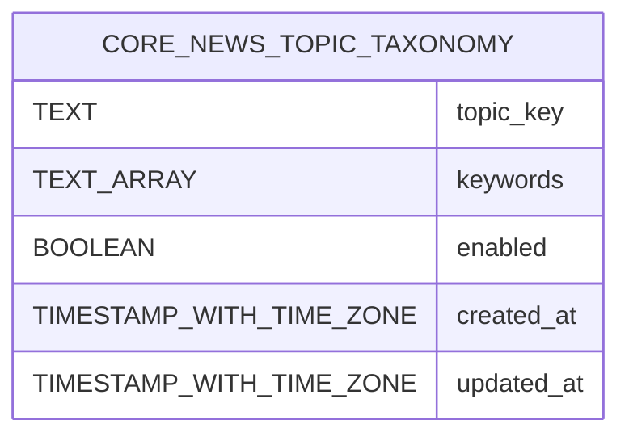

# core.news_topic_taxonomy - Table Structure Diagram

Auto-generated schema diagram showing columns and data types.

```mermaid
erDiagram
    CORE_NEWS_TOPIC_TAXONOMY {
        TEXT topic_key
        TEXT_ARRAY keywords
        BOOLEAN enabled
        TIMESTAMP_WITH_TIME_ZONE created_at
        TIMESTAMP_WITH_TIME_ZONE updated_at
    }
```
