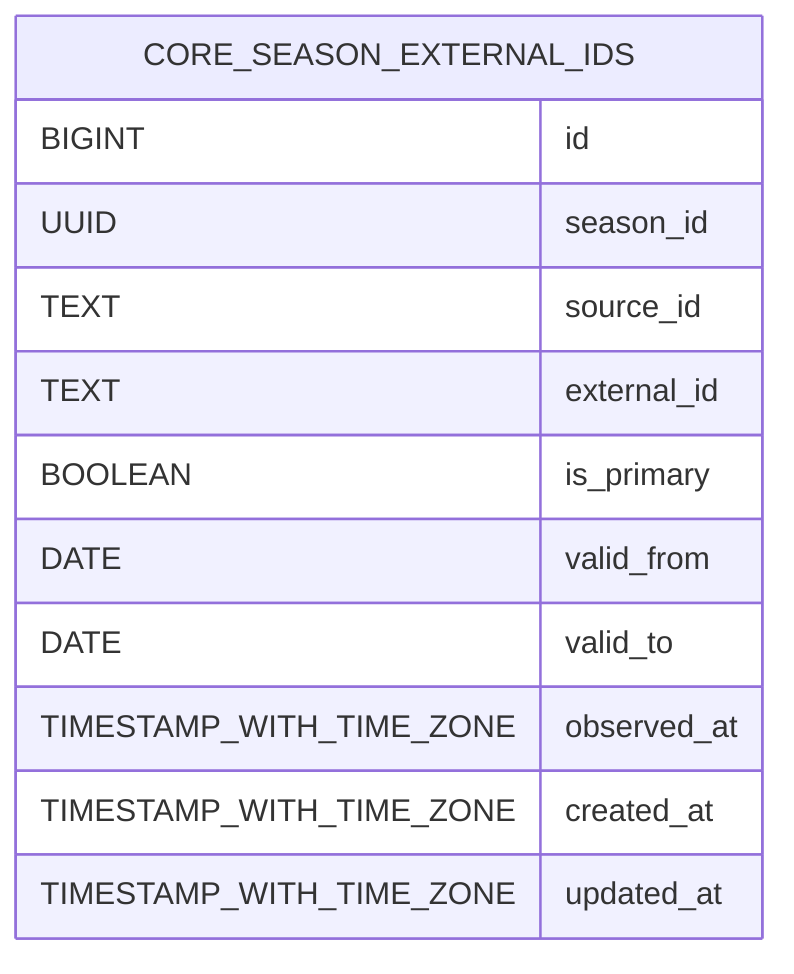

# core.season_external_ids - Table Structure Diagram

Auto-generated schema diagram showing columns and data types.

```mermaid
erDiagram
    CORE_SEASON_EXTERNAL_IDS {
        BIGINT id
        UUID season_id
        TEXT source_id
        TEXT external_id
        BOOLEAN is_primary
        DATE valid_from
        DATE valid_to
        TIMESTAMP_WITH_TIME_ZONE observed_at
        TIMESTAMP_WITH_TIME_ZONE created_at
        TIMESTAMP_WITH_TIME_ZONE updated_at
    }
```
