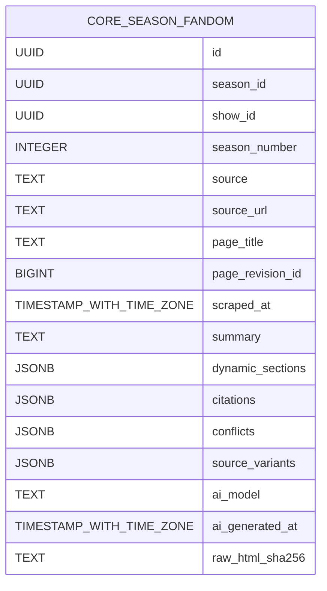

# core.season_fandom - Table Structure Diagram

Auto-generated schema diagram showing columns and data types.

```mermaid
erDiagram
    CORE_SEASON_FANDOM {
        UUID id
        UUID season_id
        UUID show_id
        INTEGER season_number
        TEXT source
        TEXT source_url
        TEXT page_title
        BIGINT page_revision_id
        TIMESTAMP_WITH_TIME_ZONE scraped_at
        TEXT summary
        JSONB dynamic_sections
        JSONB citations
        JSONB conflicts
        JSONB source_variants
        TEXT ai_model
        TIMESTAMP_WITH_TIME_ZONE ai_generated_at
        TEXT raw_html_sha256
    }
```
