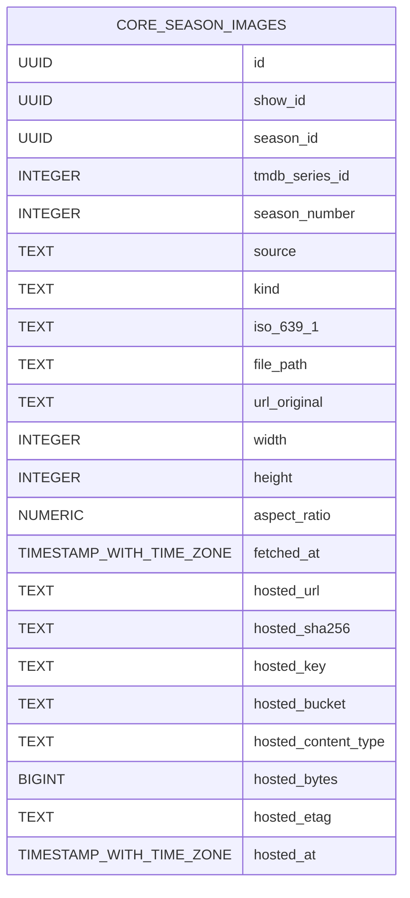

# core.season_images - Table Structure Diagram

Auto-generated schema diagram showing columns and data types.

```mermaid
erDiagram
    CORE_SEASON_IMAGES {
        UUID id
        UUID show_id
        UUID season_id
        INTEGER tmdb_series_id
        INTEGER season_number
        TEXT source
        TEXT kind
        TEXT iso_639_1
        TEXT file_path
        TEXT url_original
        INTEGER width
        INTEGER height
        NUMERIC aspect_ratio
        TIMESTAMP_WITH_TIME_ZONE fetched_at
        TEXT hosted_url
        TEXT hosted_sha256
        TEXT hosted_key
        TEXT hosted_bucket
        TEXT hosted_content_type
        BIGINT hosted_bytes
        TEXT hosted_etag
        TIMESTAMP_WITH_TIME_ZONE hosted_at
    }
```
