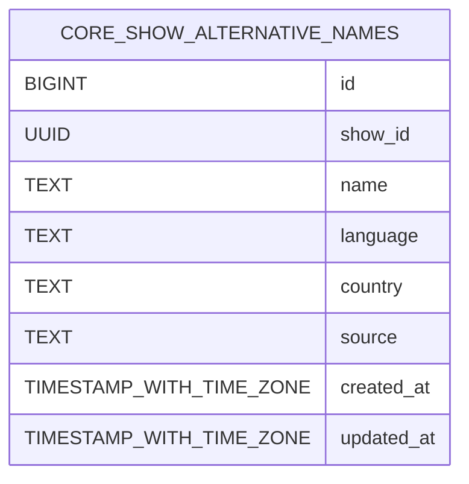

# core.show_alternative_names - Table Structure Diagram

Auto-generated schema diagram showing columns and data types.

```mermaid
erDiagram
    CORE_SHOW_ALTERNATIVE_NAMES {
        BIGINT id
        UUID show_id
        TEXT name
        TEXT language
        TEXT country
        TEXT source
        TIMESTAMP_WITH_TIME_ZONE created_at
        TIMESTAMP_WITH_TIME_ZONE updated_at
    }
```
