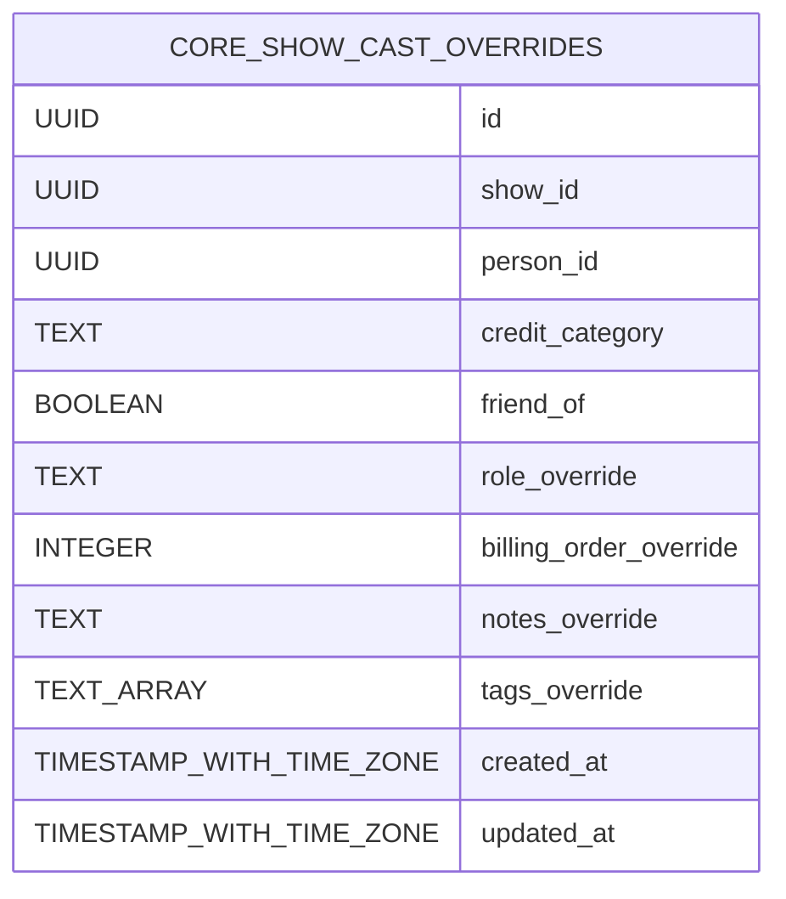

# core.show_cast_overrides - Table Structure Diagram

Auto-generated schema diagram showing columns and data types.

```mermaid
erDiagram
    CORE_SHOW_CAST_OVERRIDES {
        UUID id
        UUID show_id
        UUID person_id
        TEXT credit_category
        BOOLEAN friend_of
        TEXT role_override
        INTEGER billing_order_override
        TEXT notes_override
        TEXT_ARRAY tags_override
        TIMESTAMP_WITH_TIME_ZONE created_at
        TIMESTAMP_WITH_TIME_ZONE updated_at
    }
```
