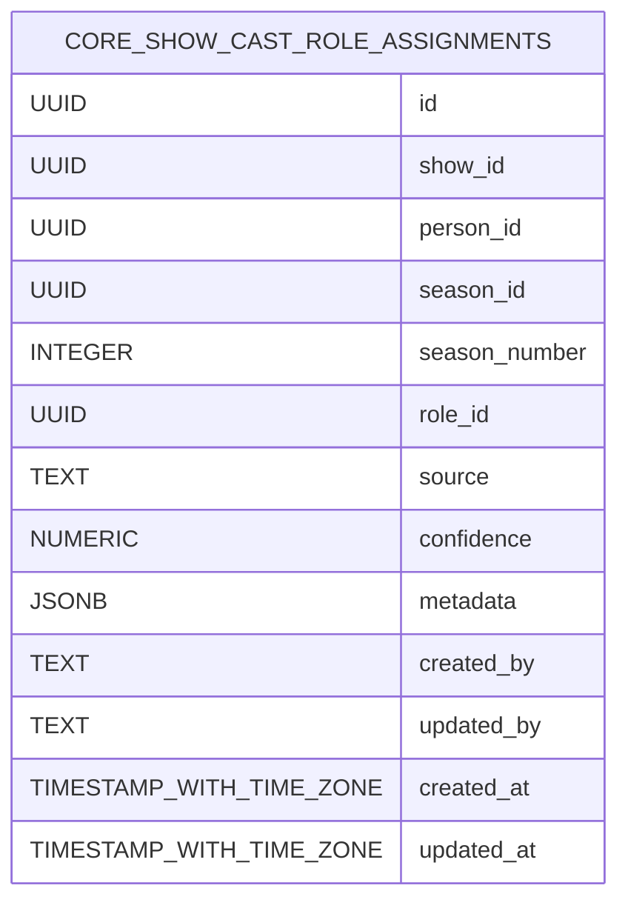

# core.show_cast_role_assignments - Table Structure Diagram

Auto-generated schema diagram showing columns and data types.

```mermaid
erDiagram
    CORE_SHOW_CAST_ROLE_ASSIGNMENTS {
        UUID id
        UUID show_id
        UUID person_id
        UUID season_id
        INTEGER season_number
        UUID role_id
        TEXT source
        NUMERIC confidence
        JSONB metadata
        TEXT created_by
        TEXT updated_by
        TIMESTAMP_WITH_TIME_ZONE created_at
        TIMESTAMP_WITH_TIME_ZONE updated_at
    }
```
