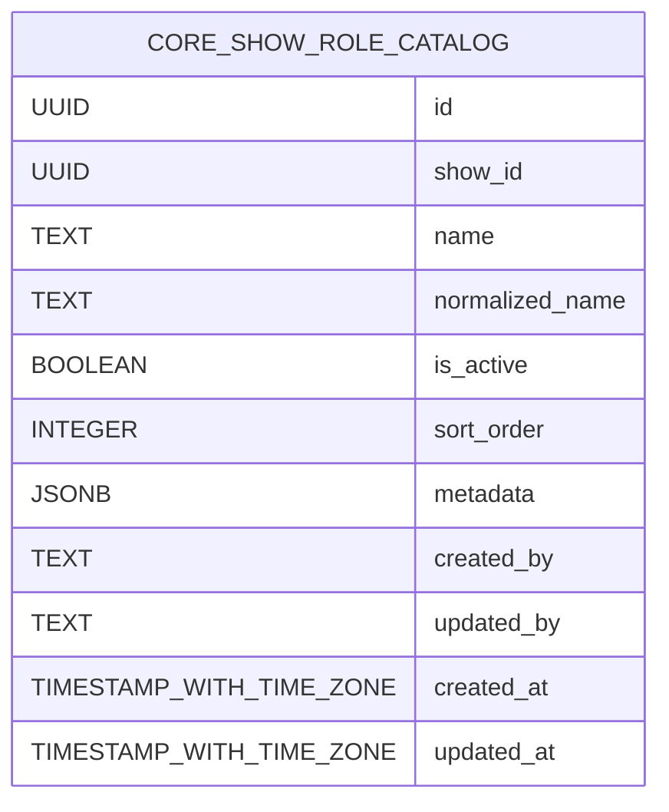

# core.show_role_catalog - Table Structure Diagram

Auto-generated schema diagram showing columns and data types.

```mermaid
erDiagram
    CORE_SHOW_ROLE_CATALOG {
        UUID id
        UUID show_id
        TEXT name
        TEXT normalized_name
        BOOLEAN is_active
        INTEGER sort_order
        JSONB metadata
        TEXT created_by
        TEXT updated_by
        TIMESTAMP_WITH_TIME_ZONE created_at
        TIMESTAMP_WITH_TIME_ZONE updated_at
    }
```
