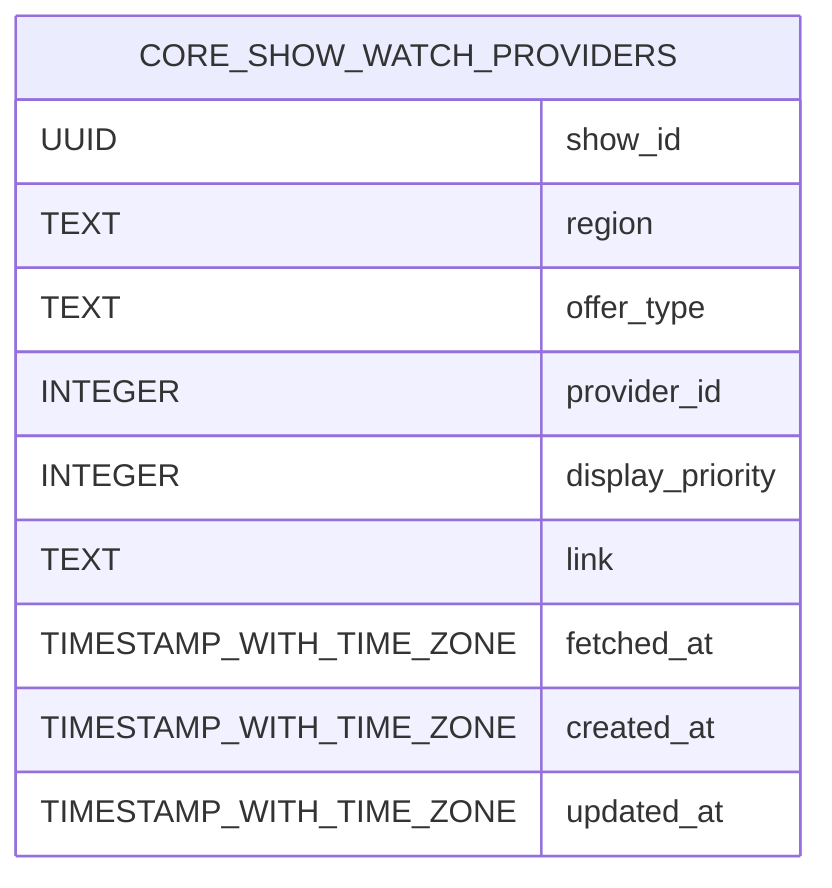

# core.show_watch_providers - Table Structure Diagram

Auto-generated schema diagram showing columns and data types.

```mermaid
erDiagram
    CORE_SHOW_WATCH_PROVIDERS {
        UUID show_id
        TEXT region
        TEXT offer_type
        INTEGER provider_id
        INTEGER display_priority
        TEXT link
        TIMESTAMP_WITH_TIME_ZONE fetched_at
        TIMESTAMP_WITH_TIME_ZONE created_at
        TIMESTAMP_WITH_TIME_ZONE updated_at
    }
```
